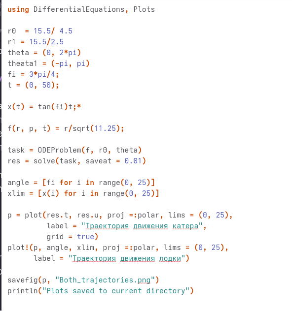
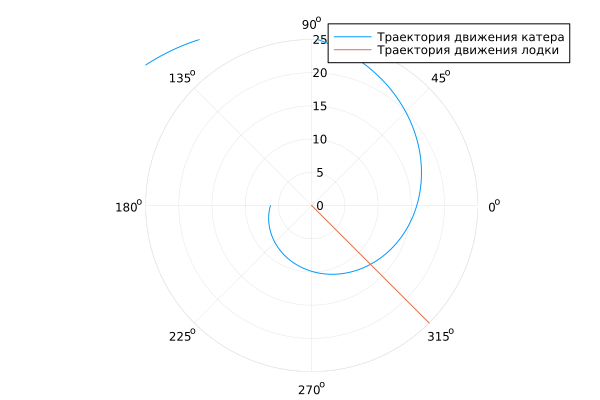

---
## Author
author:
  name: Вакутайпа Милдред
  degrees: BSc
  orcid: 0009-0001-3145-3518
  email: 1032239009@rudn.ru
  affiliation:
    - name: Российский университет дружбы народов
      country: Российская Федерация
      postal-code: 117198
      city: Москва
      address: ул. Миклухо-Маклая, д. 6
## Title
title: Презентация по математическому моделированию
subtitle: Задача о погоне
license: CC BY
date: today
date-format: "YYYY-MM-DD" # Example: 2025-09-06
---

# Информация

## Докладчик

:::::::::::::: {.columns align=center}
::: {.column width="70%"}

  * Вакутайпа Милдред
  * Группа НКНбд-01-23
  * Кафедра физико-математических и естественных наук
  * Российский университет дружбы народов им. П. Лумумбы
  * [1032239009@rudn.ru](mailto:1032239009@rudn.ru)
  * <https://wakutaipa.github.io/ru/>

:::
::::::::::::::

# Вводная часть

## Актуальность

Данная работа проводится для того, чтобы построить математическую модель для выбора проавильной стратегии решения задачи о погоне.

## Объект и предмет исследования

На море в тумане катер береговой охраны преследует лодку браконьеров. Через определенный промежуток времени туман рассеивается, и лодка обнаруживается нп расстоянии 15,5km от катера. Затем лодка снова скрывается в тумане и уходит прямолинейно в неизвестном направлении.

## Цели и задачи

1. Провести рассуждения и вывод дифференциальных уравнений если скорость катера больше скорости лодки в 3,5 раз

2. Построить траекторию движения катера для двух случаев

3. Найти точку пересечения траектории катера и лодки

# Построение модели

Чтобы поймать лодку, и катер и лодка должны находиться на одинаковым расстоянии от полюса в момент перехватка. 
Поступим следующим образом, сначала катер движется по прямой пока не достигнет точки, находящейся на том же расстоянии от полюса, на котором будет находится лодка. Как только они окажутся на одинаковом радиальном расстоянии, катер начнет маневрировать, чтобы сохранить одинаковое радиальное расстояние, одновременно огибая полюса

# Построение модели

- Примем t как продолжительность прямолиннейного движения
- $x = v*t$
- За это же время катер движется со скоростью $3,5*v$
- Возможно два случая:
	 1. Катер движется к полюсу
	 2. Катер движется от полюса

# Построение модели

$t = \dfrac{x}{v}$ , отсюда получаем:

 1. $$
    \dfrac{x}{v} = \dfrac{k - x}{3.5*v}
    $$
    
 2. $$
    \dfrac{x}{v} = \dfrac{k + v}{3.5*v}
    $$

Таким образом переключение с прямой на спиральную происходит, когда катер находится на расстоянии $x_1 = \dfrac{15.5}{4.5}$ или $x_2 = \dfrac{15.5}{2.5}$ от полюса.

# Построение модели

Как только катер окажется на расстоянии r от полюса, что и лодка, ему надо поддерживать это условие при приближении. Для этого, скорость катера делится на две составляющие в полярнвых координатах:
Радиальная скорость $v_r = \dfrac{dr}{dt} = v$.
Тангенциальная скорость $v_{\tau} = \sqrt{12.25*v^2 - v^2} = \sqrt{11.25}v = r\dfrac{d\theta}{dt}$.

# Построение модели

Отсюда получаем система дифференциальных уравнений :

$$
\dfrac{dr}{dt} = v
$$

$$
 r\dfrac{d\theta}{dt} = \sqrt{11.25}v
$$

откуда получаем 
$$
\dfrac{dr}{d\theta} = \dfrac{r}{\sqrt{11.25}v}
$$

# Модель написан с помощью julia для первого случая

{#fig-001 width=70%}

## Модель написан с помощью julia для второго случая

Потом изменила функция для вторго случая

{#fig-002 width=70%}

# Результаты

{#fig-003 width=70%}

# Результаты

{#fig-004 width=70%}

# Результат

- Мы провели рассуждение проблемы
- Построили модель
- Нашли расстояние от полюса на котором катер "пересекает" лодку 

