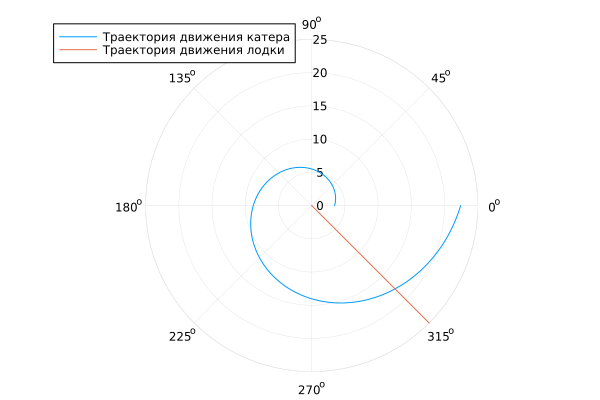

---
## Author
author:
  name: Вакутайпа Милдред
  degrees: BSc
  orcid: 0009-0001-3145-3518
  email: 1032239009@rudn.ru
  affiliation:
    - name: Российский университет дружбы народов
      country: Российская Федерация
      postal-code: 117198
      city: Москва
      address: ул. Миклухо-Маклая, д. 6

## Title
title: "Отчёт по лабораторной работе №2"
subtitle: "Задача о погоне"
license: "CC BY"
---

# Цель работы

Построить математическую модель для выбора проавильной стратегии решения задачи о погоне.

# Задание

Вариант: 1032239009%70 + 1 = 40

На море в тумане катер береговой охраны преследует лодку браконьеров. Через определенный промежуток времени туман рассеивается, и лодка обнаруживается нп расстоянии 15,5km от катера. Затем лодка снова скрывается в тумане и уходит прямолинейно в неизвестном направлении.

1. Провести рассуждения и вывод дифференциальных уравнений если скорость катера больше скорости лодки в 3,5 раз

2. Построить траекторию движения катера для двух случаев

3. Найти точку пересечения траектории катера и лодки

# Теоретическое введение

Кривая погони есть кривая, представляющая собой решение задачи о пагоне которая ставится следующим образом. Пусть точка А равномерно движется по некоторой заданной кривойю Требуется найти траекторию равномерного движения точки B такую, что касательная, проведенная к траектории в любой момент движения, проходила бы через соответсвующее этому моменту положение точки А. 

# Выполнение лабораторной работы

Пусть точка на которой была обнаружена лодка бракньера (полюс) - $x_0 = 0$ при $t_0= 0$, и катер береговой охраны находится 15,5 km от полюса. Полюс - последнее известное место нахождения лодки и полярная ось (исходное направления) есть линия от полюса до катера.
Чтобы поимать лодку, и катер и лодка должны находится на одинаковым расстоянии от полюса в момент перехватка.

Сначала катер движется по прямой (либо по направлению полюса, либо от него) пока не достигнет точки, находящейся на том же расстоянии от полюса, на котором будет находится лодка. Как только они окажутся на одинаковом радиальном расстоянии, катер начнет маневрировать, чтобы сохранить одинаковое радиальное расстояние, одновременно огибая полюса (двигатся вокруг полюса удаляясь от него с той же скоростью, что и лодка).

Для того чтобы найти расстояние x от полюса, на котором катер заканчивает двигаться прямолиннейно, примияем t как продолжительность прямолиннейного движения. За это время, лодка преодолевает расстояние x со скоростью v. Итак $x = v*t$ . За это же время катер движется со скоростью $3,5*v$ от его начальное положения к до точки x. Возможно два случая:

 1. Катер движется к полюсу и проходит путь k - x и получаем $k - x = 3.5*v*t$ ;
 
 2. Катер движется от полюса и проходит путь $k+x= 3.5vt$.
 
Так как $t = \dfrac{x}{v}$ , получаем 

 1. $$
    \dfrac{x}{v} = \dfrac{k - x}{3.5*v}
    $$
    
 2. $$
    \dfrac{x}{v} = \dfrac{k + v}{3.5*v}
    $$

Таким образом переключение с прямой на спиральную происходит, когда катер находится на расстоянии $x_1 = \dfrac{15.5}{4.5}$ или $x_2 = \dfrac{15.5}{2.5}$ от полюса.

Как только катер окажется на расстоянии r от полюса, что и лодка, ему надо поддерживать это условие при приближении. Для этого, скорость катера делится на две составляющие в полярнвых координатах:

 Радиальная скорость $v_r$ с которой катер удаляется от полюса. Она должна быть равна скорости лодки v, чтобы остоватся на том же радиусе. $v_r = \dfrac{dr}{dt} = v$.
 
 Тангенцальная скорость - линейная скорость вращения катера относительно полюса и вычисляется с помощью теорема Пифагора. Она равна $v_{\tau} = \sqrt{12.25*v^2 - v^2} = \sqrt{11.25}v = r\dfrac{d\theta}{dt}$.
 
Отсюда получаем система дифференциальных уравнений :

$$
\dfrac{dr}{dt} = v
$$

$$
 r\dfrac{d\theta}{dt} = \sqrt{11.25}v
$$

Разделив одно уравнение на другое мы можем получить дифференцальное уравнение для траектории в полярных координатах: 
$$
\dfrac{dr}{d\theta} = \dfrac{r}{sqrt{11.25}v}
$$

## Модель написана на языке julia

``` julia

using DifferentialEquations, Plots

x1  = 15.5/ 4.5  # положение на время переключения, случай 1 
x2 = 15.5/2.5	  # положение на время переключения, случай 2

theta = (0, 2*pi)
theata1 = (-pi, pi)


fi = 3*pi/4; # угол наклона прямой
t = (0, 50);

x(t) = tan(fi)t;* # функция описывающая траектория лодки

f(r, p, t) = r/sqrt(11.25); # функция описывающая траектория катера

task = ODEProblem(f, x1, theta)
res = solve(task, saveat = 0.01)

angle = [fi for i in range(0, 25)]
xlim = [x(i) for i in range(0, 25)]

p = plot(res.t, res.u, proj =:polar, lims = (0, 25), 
         label = "Траектория движения катера", 
         grid = true)
plot!(p, angle, xlim, proj =:polar, lims = (0, 25), 
      label = "Траектория движения лодки")
      
savefig(p, "Both_trajectories.png")
println("Plots saved to current directory")

```

Точка пересечения судя по полученному графику ~ 17

{#fig-001 width=70%}

И для второй случаи поменяем зачение x1 на x2 

``` julia


using DifferentialEquations, Plots

x1  = 15.5/ 4.5  
x2 = 15.5/2.5	 

theta = (0, 2*pi)
theata1 = (-pi, pi)


fi = 3*pi/4; 
t = (0, 50);

x(t) = tan(fi)t;*  #функция описывающая траектория лодки

f(r, p, t) = r/sqrt(11.25); #функция описывающая траектория катера

task = ODEProblem(f, x2, theta) # <-- замена здесь
res = solve(task, saveat = 0.01)

angle = [fi for i in range(0, 25)]
xlim = [x(i) for i in range(0, 25)]

p = plot(res.t, res.u, proj =:polar, lims = (0, 25), 
         label = "Траектория движения катера", 
         grid = true)
plot!(p, angle, xlim, proj =:polar, lims = (0, 25), 
      label = "Траектория движения лодки")
      
savefig(p, "Both_trajectories.png")
println("Plots saved to current directory")

```

Точка пересечения судя по полученному графику приблизительно 12.

{#fig-002 width=70%}

# Выводы

При выполнении данной работы, я построила математическую модель для выбора проавильной стратегии решения задачи о погоне.

# Список литературы{.unnumbered}

[Кривая погони](https://ru.wikipedia.org/wiki/Кривая_погони)

