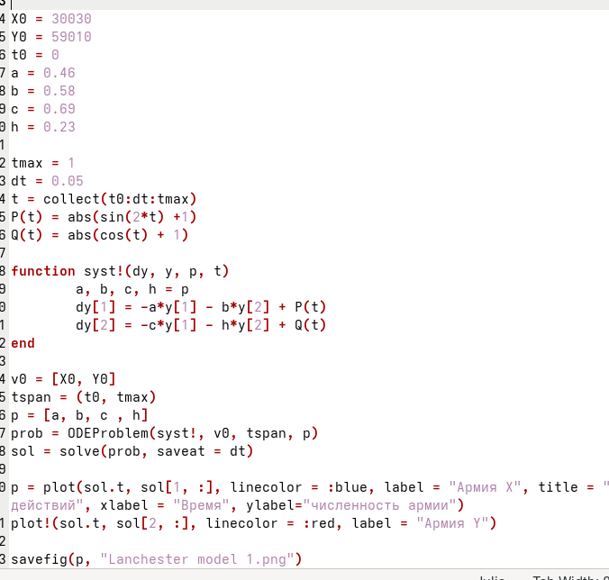
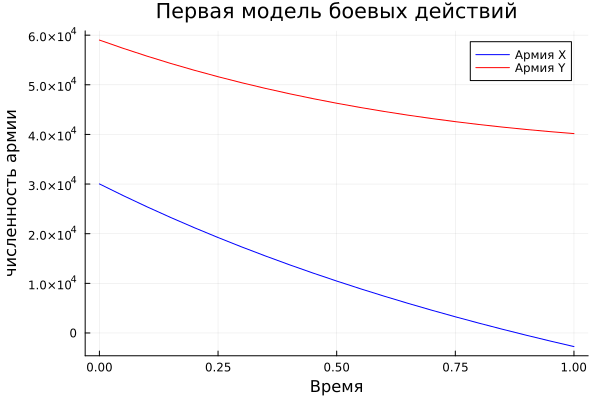

---
## Author
author:
  name: Вакутайпа Милдред
  degrees: BSc
  orcid: 0009-0001-3145-3518
  email: 1032239009@rudn.ru
  affiliation:
    - name: Российский университет дружбы народов
      country: Российская Федерация
      postal-code: 117198
      city: Москва
      address: ул. Миклухо-Маклая, д. 6
## Title
title: Презентация по лаборатроной работе №3
subtitle: Модель боевых действий
license: CC BY
date: today
date-format: "YYYY-MM-DD" # Example: 2025-09-06
---

# Информация

## Докладчик

:::::::::::::: {.columns align=center}
::: {.column width="70%"}

  * Вакутайпа Милдред
  * НКНбд-01-23
  * Кафедра Математическое моделирование и исскуственного интелекта
  * Российский университет дружбы народов им. П. Лумумбы
  * [1032239009@rudn.ru](mailto:1032239009@rudn.ru)
  * <https://wakutaipa.github.io/ru/>

:::
::::::::::::::

# Цель работы

Цель данной работы -- рассмотреть некоторые простейшие модели боевых действий - Модели Ланчестера.

# Задание

Между страной X и страной Y иднт война. Численность состава войск исчисляется от начала войны, и являются временными функциями x(t) и y(t). В начальный моменнт времени страна X имеет армию численностью 30030 человек, а в распоряжении страны Y армия численностью 59010 человек. Для упрощения модели считаем, что коэффициенты a, b, c, h постоянны. Также считаем P(t) и Q(t) непрерывные функции.
Надо построить графики изменения численности войск армии x и армии Y для следующих случаев:

## Задание

1. Модель боевых действий между регулярными войсками

$$\begin{cases}
	\dfrac{dx}{dt} = -0,46 x(t) -0,58y(t) + |sin(2t) + 1|\\
	\dfrac{dy}{dt} = -0,69x(t) -0,23y(t) + |cos(t) + 1|
\end{cases}$$

2. Модель ведение боевых действий с участием регулярных войск и партизанских отрядов

$$\begin{cases}
	\dfrac{dy}{dt} = -0,37x(t) -0,71y(t) + |sin(2t) + 1|\\
	\dfrac{dy}{dt} = -0,77x(t)y(t) -0,2y(t) + |cos(t) + 2|
\end{cases}$$

# Теоретическое введение

Модель Ланчестера описывается поведение двух противоборствующих участнико военного конфликта. Главной характеристикой соперников являются численности сторон, изменяющиеся в зависимости от различных факторов, как обусловленных действиями соперников, так и не связанных напрямую с военными действиями. Ставится цель достижения нужной численности армий к концу заданного периода.

# Выполнение лабораторной работы

## Модель боевых действий между регулярными войсками

$$\begin{cases}
	\dfrac{dx}{dt} = -0,46 x(t) -0,58y(t) + |sin(2t) + 1|\\
	\dfrac{dy}{dt} = -0,69x(t) -0,23y(t) + |cos(t) + 1|
\end{cases}$$

## Модель боевых действий между регулярными войсками

Напишем код модели с помощью языка программирования julia:

{#fig-001 width=70%}

## Модель боевых действий между регулярными войсками

{#fig-002 width=70%}

## Модель ведение боевых действий с участием регулярных войск и партизанских отрядов

$$\begin{cases}
	\dfrac{dy}{dt} = -0,37x(t) -0,71y(t) + |sin(2t) + 1|\\
	\dfrac{dy}{dt} = -0,77x(t)y(t) -0,2y(t) + |cos(t) + 2|
\end{cases}$$

## Модель ведение боевых действий с участием регулярных войск и партизанских отрядов

Кодируем наш модель с julia:

``` julia 

function syst!(dy, y, p, t)
	a, b, c, h = p
	dy[1] = -a*y[1] - b*y[2] + P(t)
	dy[2] = -c*y[1]*y[2] - h*y[2] + Q(t)
end

```

## Модель ведение боевых действий с участием регулярных войск и партизанских отрядов

И получим следующий график:

{#fig-002 width=70%}


# Выводы

При выполнении данной работы, мы познакомились с простейшими моделями Ланчестера и построили модели с помощью языка программирования julia для боевых действий между регулярными войсками и ведение боевых действий с участием регулярных войск и партизанских отрядов.


