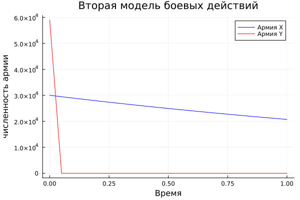

---
## Author
author:
  name: Вакутайпа Милдред
  degrees: BSc
  orcid: 0009-0001-3145-3518
  email: 1032239009@rudn.ru
  affiliation:
    - name: Российский университет дружбы народов
      country: Российская Федерация
      postal-code: 117198
      city: Москва
      address: ул. Миклухо-Маклая, д. 6

## Title
title: "Отчёт по лабораторной работе №3"
subtitle: "Модель боевых действий"
license: "CC BY"
---

# Цель работы

Цель данной работы -- рассмотреть некоторые простейшие модели боевых действий - Модели Ланчестера.

# Задание

Между страной X и страной Y иднт война. Численность состава войск исчисляется от начала войны, и являются временными функциями x(t) и y(t). В начальный моменнт времени страна X имеет армию численностью 30030 человек, а в распоряжении страны Y армия численностью 59010 человек. Для упрощения модели считаем, что коэффициенты a, b, c, h постоянны. Также считаем P(t) и Q(t) непрерывные функции.
Надо построить графики изменения численности войск армии x и армии Y для следующих случаев:

1. Модель боевых действий между регулярными войсками

$$\begin{cases}
	\dfrac{dx}{dt} = -0,46 x(t) -0,58y(t) + |sin(2t) + 1|\\
	\dfrac{dy}{dt} = -0,69x(t) -0,23y(t) + |cos(t) + 1|
\end{cases}$$

2. Модель ведение боевых действий с участием регулярных войск и партизанских отрядов

$$\begin{cases}
	\dfrac{dy}{dt} = -0,37x(t) -0,71y(t) + |sin(2t) + 1|\\
	\dfrac{dy}{dt} = -0,77x(t)y(t) -0,2y(t) + |cos(t) + 2|
\end{cases}$$

# Теоретическое введение

Модель Ланчестера описывается поведение двух противоборствующих участнико военного конфликта. Главной характеристикой соперников являются численности сторон, изменяющиеся в зависимости от различных факторов, как обусловленных действиями соперников, так и не связанных напрямую с военными действиями. Ставится цель достижения нужной численности армий к концу заданного периода. [1]

# Выполнение лабораторной работы

## Модель боевых действий между регулярными войсками

$$\begin{cases}
	\dfrac{dx}{dt} = -0,46 x(t) -0,58y(t) + |sin(2t) + 1|\\
	\dfrac{dy}{dt} = -0,69x(t) -0,23y(t) + |cos(t) + 1|
\end{cases}$$

Потери не связанные с боевыми действиями, описывают члены  -0,46x(t) и -0,23y(t), члены -0,58y(t) и -0,69x(t) указывают на эффективность ябоевых действий со стороны x и y соответственно, -0,46x(t) и -0,23y(t) величины, характеризующие степень влияния различных факторов на потери. Функции |sin(2t) + 1| и |cos(t) + 1| учитывают возможность подхода подкрепления к войскам X и Y в течение одного дня.

Напишем код модели с помощью языка программирования julia:

``` julia

using DifferentialEquations
using Plots

X0 = 30030
Y0 = 59010
t0 = 0

a = 0.46 
b = 0.58
c = 0.69
h = 0.23

tmax = 1
dt = 0.05

t = collect(t0:dt:tmax)

P(t) = abs(sin(2*t) +1)
Q(t) = abs(cos(t) + 1)

function syst!(dy, y, p, t)
	a, b, c, h = p
	dy[1] = -a*y[1] - b*y[2] + P(t)
	dy[2] = -c*y[1] - h*y[2] + Q(t)
end

v0 = [X0, Y0]
tspan = (t0, tmax)
p = [a, b, c , h]

prob = ODEProblem(syst!, v0, tspan, p)
sol = solve(prob, saveat = dt)

p = plot(sol.t, sol[1, :], linecolor = :blue, label = "Армия X", title = "Первая модель боевых действий", xlabel = "Время", ylabel="численность армии")
plot!(sol.t, sol[2, :], linecolor = :red, label = "Армия Y")

savefig(p, "Lanchester model 1.png")

```
 
{#fig-001 width=70%}

Из графики видно как численность меняетс я со временем. В этом случае, армия X проиграет поскольку армии уменшается до нули а у армии Y, численность уменшается но остается больше нули.

## Модель ведение боевых действий с участием регулярных войск и партизанских отрядов

В этом случае в борьбу добавляются партизанские отряды. Нерегулярные войска в отличии от постоянной армии менее уязвимы, так как действуют скрытно, в этом случае сопернику приходится действовать неизбрательно, по площадям, занимаемым партизанами. Поэтому считается, что тем потрерь партизан, проводящих свои опреации в разных местах нп некоторой известной территории, пропорционален не только численности армеййских соединений, но и численности самих партизан. В результате наш модель принимает вид 

$$\begin{cases}
	\dfrac{dy}{dt} = -0,37x(t) -0,71y(t) + |sin(2t) + 1|\\
	\dfrac{dy}{dt} = -0,77x(t)y(t) -0,2y(t) + |cos(t) + 2|
\end{cases}$$

Кодируем наш модель с julia:

``` julia 

using DifferentialEquations
using Plots

X0 = 30030
Y0 = 59010
t0 = 0

a = 0.37 
b = 0.71
c = 0.77
h = 0.2

tmax = 1
dt = 0.05

t = collect(t0:dt:tmax)

P(t) = abs(sin(2*t) +1)
Q(t) = abs(cos(t) + 2)

function syst!(dy, y, p, t)
	a, b, c, h = p
	dy[1] = -a*y[1] - b*y[2] + P(t)
	dy[2] = -c*y[1]*y[2] - h*y[2] + Q(t)
end

v0 = [X0, Y0]
tspan = (t0, tmax)
p = [a, b, c , h]

prob = ODEProblem(syst!, v0, tspan, p)
sol = solve(prob, saveat = dt)

p = plot(sol.t, sol[1, :], linecolor = :blue, label = "Армия X", title = "Вторая модель боевых действий", xlabel = "Время", ylabel="численность армии")
plot!(sol.t, sol[2, :], linecolor = :red, label = "Армия Y")

savefig(p, "Lanchester model 2.png")

```

И получим следующий график:

{#fig-002 width=70%}

В этот раз армия X выиграет. 

# Выводы

При выполнении данной работы, я познакомилась с простейшими моделями Ланчестера и построила модели с помощью языка программирования julia для боевых действий между регулярными войсками и ведение боевых действий с участием регулярных войск и партизанских отрядов.

# Список литературы{.unnumbered}

1. [Модель Ланчестера](https://cyberleninka.ru/article/n/model-lanchestera-kak-diskretnaya-upravlyaemaya-sistema)

2. [Лабораторная работа №3](https://esystem.rudn.ru/pluginfile.php/3094571/mod_resource/content/2/%D0%9B%D0%B0%D0%B1%D0%BE%D1%80%D0%B0%D1%82%D0%BE%D1%80%D0%BD%D0%B0%D1%8F%20%D1%80%D0%B0%D0%B1%D0%BE%D1%82%D0%B0%20%E2%84%96%202.pdf)

::: {#refs}
:::
