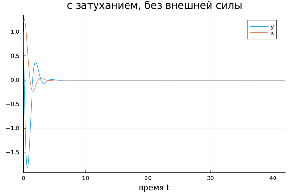
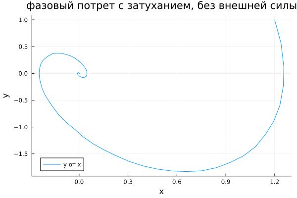
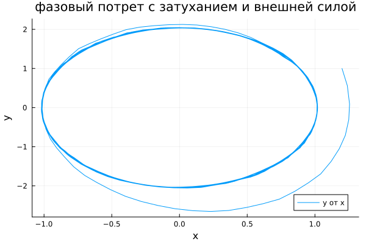

---
## Author
author:
  name: Вакутайпа Милдред
  degrees: DSc
  orcid: 0009-0001-3145-3518
  email: 1032239009@rudn.ru
  affiliation:
    - name: Российский университет дружбы народов
      country: Российская Федерация
      postal-code: 117198
      city: Москва
      address: ул. Миклухо-Маклая, д. 6
## Title
title: Презентация по математическому моделированию
subtitle: Модель гари=монических колебаний
license: CC BY
date: today
date-format: "YYYY-MM-DD" # Example: 2025-09-06
---

# Информация

## Докладчик

:::::::::::::: {.columns align=center}
::: {.column width="70%"}

  * Вакутайпа Милдред
  * НКНбд-01-23
  * Студентка кафедры маиематического моделирования и исскуственого интелекта 
  * Российский университет дружбы народов им. П. Лумумбы
  * [1032239009@rudn.ru](mailto:1032239009@rudn.ru)
  * <https://wakutaipa.github.io>

:::
::: {.column width="30%"}


:::
::::::::::::::

# Цель работы

Научиться строить математические модели для гармонических колебаний.

# Задание

1. Постройть фазовый портрет гармонического осциллятора и решение уравнения гармонического осциллятора для следующих случаев

1. Колебания гармонического осциллятора без затуханий и без действий внешней силы $\ddot x + 7.5x = 0$
2. Колебания гармонического осциллятора c затуханием и без действий внешней силы $\ddot x + 2\dot x + 5.5x = 0$
3. Колебания гармонического осциллятора c затуханием и под действием внешней силы $\ddot x + 2.4\dot x + 5x = 5.2\sin{(2t)}$

На интервале $t \in [0; 42]$ (шаг 0.05) с начальными условиями $x_0 = 1.2, \, y_0=1.0$ +

# Выполнение лабораторной работы

## Модель

- Модель гармонических колебаний - линейный гармонический осциллятор.
-Построила модель для решения функции и построения их фазовые траетктории и портреты.

```julia

using DifferentialEquations
using Plots

```

## Модель

``` julia
tspan = (0, 42)

q1 = [0, 7.5]
q2 = [2, 5.5]
q3 = [2.4, 5]

du0 = [1.0]  
u0 = [1.2] 

```

## Модель

``` julia

function harm_osc(ddu, du, u, q, t)
    g, w = q
    ddu .= -g.*du .- w.*u
end

f(t) = 5.2*sin(2*t)

function harm_osc2(ddu, du, u, q, t)
    g, w = q
    ddu .= -g*du .- w*u .- f(t)
end
```

```julia
task1 = SecondOrderODEProblem(harm_osc, du0, u0, tspan, q1)
sol1 = solve(task1, DPRKN6(), saveat = 0.05)
```

## Модель

```julia
function plot_osc(sol, title)
	plot(sol, vars=(0, 1), label="y", xlabel="время t", ylabel="", title=title)
	plot!(sol, vars=(0,2), label="x", xlabel="время t", ylabel="", title=title)
end
```

## Модель

```julia
pl1 = plot_osc(sol1, "без затухания и внешней силы")
cp1 = plot(sol1, vars=(2,1), label="y от x", xlabel="x", ylabel="y", title="фазовый потрет без затухания и внешней силы")
savefig(pl1, "1.png")
savefig(cp1, "2.png")
```

## Без затухания и действия внешней силы

{#fig-001 width=70%}

## Без затухания и действия внешней силы

{#fig-002 width=70%}

## С затуханием, без действия внешней силы

{#fig-003 width=70%}

## С затуханием, без действия внешней силы

{#fig-004 width=70%}

## С затуханием и действием внешней силы

{#fig-005 width=70%}

## С затуханием и действием внешней силы

{#fig-006 width=70%}

# Выводы

При выполнение данной работы я научилась строить математические модели для гармонических колебаний.

