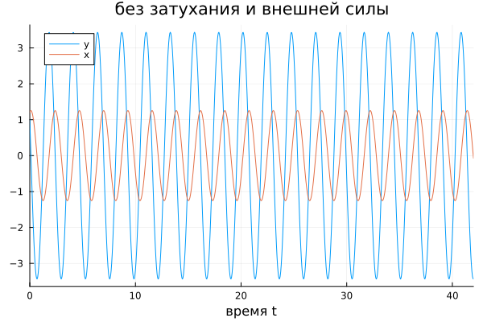
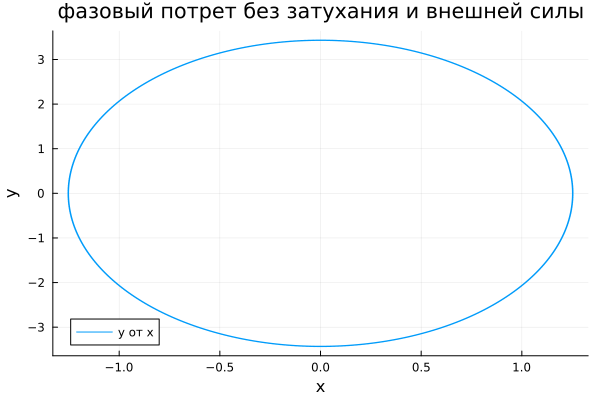
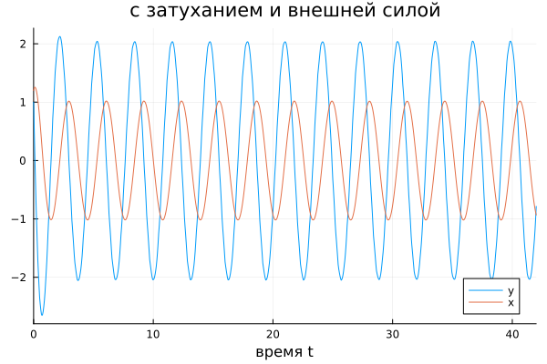

---
## Author
author:
  name: Вакутайпа Милдред
  degrees: BSc
  orcid: 0009-0001-3145-3518
  email: 1032239009@rudn.ru
  affiliation:
    - name: Российский университет дружбы народов
      country: Российская Федерация
      postal-code: 117198
      city: Москва
      address: ул. Миклухо-Маклая, д. 6

## Title
title: "Отчёт по лабораторной работе №4"
subtitle: "Модель гармонических колебаний"
license: "CC BY"
---

# Цель работы

Научиться строить математические модели для гармонических колебаний.

# Задание

1. Постройть фазовый портрет гармонического осциллятора и решение уравнения гармонического осциллятора для следующих случаев

1. Колебания гармонического осциллятора без затуханий и без действий внешней силы $\ddot x + 7.5x = 0$
2. Колебания гармонического осциллятора c затуханием и без действий внешней силы $\ddot x + 2\dot x + 5.5x = 0$
3. Колебания гармонического осциллятора c затуханием и под действием внешней силы $\ddot x + 2.4\dot x + 5x = 5.2\sin{(2t)}$

На интервале $t \in [0; 42]$ (шаг 0.05) с начальными условиями $x_0 = 1.2, \, y_0=1.0$ +

# Выполнение лабораторной работы

Модель гармонических колебаний - линейный гармонический осциллятор.  С помощью языка программирования julia, построила модель ддля решения однородной и неоднародной функции и построения их фазовые траетктории и портреты.

```julia

using DifferentialEquations
using Plots

tspan = (0, 42)

q1 = [0, 7.5]
q2 = [2, 5.5]
q3 = [2.4, 5]

du0 = [1.0]  
u0 = [1.2]  

function harm_osc(ddu, du, u, q, t)
    g, w = q
    ddu .= -g.*du .- w.*u
end

f(t) = 5.2*sin(2*t)

function harm_osc2(ddu, du, u, q, t)
    g, w = q
    ddu .= -g*du .- w*u .- f(t)
end

task1 = SecondOrderODEProblem(harm_osc, du0, u0, tspan, q1)
sol1 = solve(task1, DPRKN6(), saveat = 0.05)

task2 = SecondOrderODEProblem(harm_osc, du0, u0, tspan, q2)
sol2 = solve(task2, DPRKN6(), saveat = 0.05)

task3 = SecondOrderODEProblem(harm_osc2, du0, u0, tspan, q3)
sol3 = solve(task3, DPRKN6(), saveat = 0.05)

function plot_osc(sol, title)
	plot(sol, vars=(0, 1), label="y", xlabel="время t", ylabel="", title=title)
	plot!(sol, vars=(0,2), label="x", xlabel="время t", ylabel="", title=title)
end

pl1 = plot_osc(sol1, "без затухания и внешней силы")
cp1 = plot(sol1, vars=(2,1), label="y от x", xlabel="x", ylabel="y", title="фазовый потрет без затухания и внешней силы")
savefig(pl1, "1.png")
savefig(cp1, "2.png")

pl1 = plot_osc(sol2, "с затуханием, без внешней силы")
cp1 = plot(sol2, vars=(2,1), label="y от x", xlabel="x", ylabel="y", title="фазовый потрет с затуханием, без внешней силы")
savefig(pl1, "3.png")
savefig(cp1, "4.png")

pl1 = plot_osc(sol3, "с затуханием и внешней силой")
cp1 = plot(sol3, vars=(2,1), label="y от x", xlabel="x", ylabel="y", title="фазовый потрет с затуханием и внешней силой")
savefig(pl1, "5.png")
savefig(cp1, "6.png")

```

В результате получила: 
Решение уравнения гармонического осциллятора без затухания и внешней силы (Рис @fig-001,) и его фазовый портрет (Рис. @fig-002);

{#fig-001 width=70%}

{#fig-002 width=70%}

Решение уравнения гармонического осциллятора с затуханием без внешней силы (Рис @fig-003,) и его фазовый портрет (Рис. @fig-004);

{#fig-003 width=70%}

{#fig-004 width=70%}

Решение уравнения гармонического осциллятора с затуханием и внешней силой (Рис @fig-005,) и его фазовый портрет (Рис. @fig-006).

{#fig-005 width=70%}

{#fig-006 width=70%}

#Ответы к вопросам

1. Запишите простейшую модель гармонических колебаний

Простейшая модель гармонических колебаний описывается уравнением $\ddot x + \omega_0^2 = 0$,

где: 
	x - переменная которая описывает состояние системы 
	$\omega$ - частота колебаний
	$\ddot x = \frac{\partial^2 x}{\partial t^2}$ - вторая производная по времени 

2. Дайте определение осциллятора

Осциллятор - система, которая имеет свое состояние вблизи положения равновесия. Он описывается дифференциальным уравнениям:

$$
\ddot{x} + 2\gamma\dot{x} + \omega_0^2 = 0
$$

Где:
	x - переменная которая описывает состояние системы 
	$\gamma$ - параметр, характеризующий потери энергии
	$\omega$ - частота колебаний
	$\dot x = \frac{\partial x}{\partial t}$ и $\ddot x = \frac{\partial^2 x}{\partial t^2}$ - первая и вторая производная по времени 

3. Запишите модель математического маятника

Модель математического маятника - частное случае гармонического осциллятора. Для малых углов отклонения уравнение записывается: 

$$
\ddot{\theta} + \frac{g}{l} \theta = 0
$$

где:
	$\theta$ - угловое смещение маятника от вертикали
	$g$ - ускорение свободного падения
	$l$ - длина подвеса маятника
	$\ddot{\theta}$ - вторая производная углового смещения прр времени
	
4. Запишите алгоритм перехода от дифференциального уравнения второго порядка к двум дифференциальным уравнениям первого порядка.

Введем новую переменную $y$, равную первой производной исходной переменной:

$y = \dot{x}$

Выразим вторую производную через новую переменную:

$$
\ddot{x} = \dot{y}.
$$

Подставим эти выражения в исходное уравнение второго порядка. Например, для уравнения консервативного осциллятора:

$$
\ddot{x} + \omega_0^2 x = 0
$$

получаем:

$$
\dot{y} + \omega_0^2 x = 0.
$$

Запишем систему из двух уравнений первого порядка:

$$
\begin{cases}
\dot{x} = y, \\
\dot{y} = -\omega_0^2 x.
\end{cases}
$$

5. Что такое фазовый портрет и фазовая траектория?

Фазовый портрет - картина, образованная набором фазовых траекторий.
Фазовая траектория - кривая в фазовом пространстве, описывающая изменения состояния системы во времени. 


# Выводы

При выполнение данной работы я научилась строить математические модели для гармонических колебаний.

# Список литературы{.unnumbered}

::: {#refs}
:::
