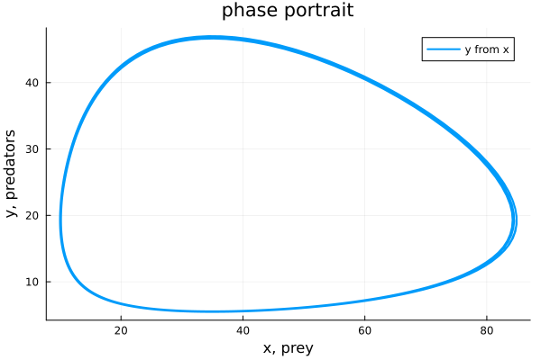
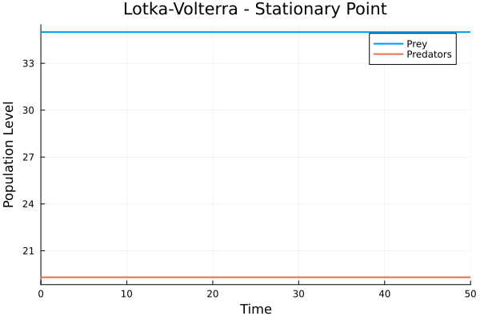
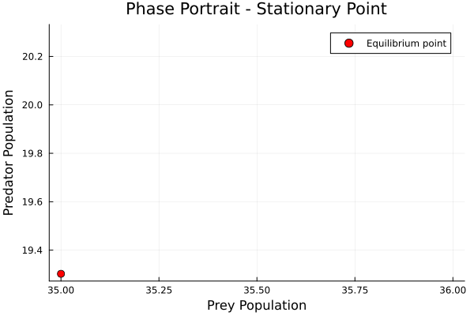

---
## Author
author:
  name: Вакутайпа Милдред
  degrees: BSc
  orcid: 0009-0001-3145-3518
  email: 1032239009@rudn.ru
  affiliation:
    - name: Российский университет дружбы народов
      country: Российская Федерация
      postal-code: 117198
      city: Москва
      address: ул. Миклухо-Маклая, д. 6

## Title
title: "Отчёт по лабораторной работе №5"
subtitle: "Модель хищник-жертва"
license: "CC BY"
---

# Цель работы

Применить простейшую модель взаимодействия двух видов типа «хищник— жертва» -модель Лотки-Вольтерры.

# Задание

Для модели «хищник-жертва»:

$$\frac{dx}{dt} = -0.83x(t) + 0.043x(t)y(t)$$

$$\frac{dy}{dt} = 0.84y(t) - 0.024x(t)y(t)$$

Постройте график зависимости численности хищников от численности жертв, а также графики изменения численности хищников и численности жертв при следующих начальных условиях: $x_0 = 10$, $y_0 = 20$. Найдите стационарное состояние системы.

# Теоретическое введение

Данная двувидовая модель основывается на следующих предположениях:

1. Численность популяции жертв x и хищников y зависят только от времени (модель не учитывает пространственное распределение популяции на занимаемой территории)

2. В отсутствии взаимодействия численность видов изменяется по модели Мальтуса, при этом число жертв увеличивается, а число хищников падает

3. Естественная смертность жертвы и естественная рождаемость хищника считаются несущественными

4. Эффект насыщения численности обеих популяций не учитывается

5. Скорость роста численности жертв уменьшается пропорционально
численности хищников

# Выполнение лабораторной работы

Построила модель для хищник-жертва:

``` julia

using DifferentialEquations
using Plots

u0 = [10, 20]
p = [0.83, 0.84, 0.043, 0.024]
tspan = (0.0, 50.0)

function lotkavolter(u, p, t)
	x,y = u
	a,b,c,d = p
	dx = -a*x + c*x*y
	dy = b*y -d*x*y
	return[dx, dy]
end

problem = ODEProblem(lotkavolter, u0, tspan, p)
solution = solve(problem, Tsit5())

a = plot(solution, title="Lotka-volter model", xlabel="time", ylabel="population level", label=["prey" "predators"], linewidth=2)

b = plot(solution, idxs=(1,2), title="phase portrait", label="y from x", xlabel="x, prey", ylabel="y, predators", linewidth=2)

savefig(a, "Lotka-volter_model.png")
savefig(b, "phase_portrait.png")

```

Далее рисовала график зависимости численности ([рис. @fig-001]) и фазовый портрет ([рис. @fig-002]).

{#fig-001 width=70%}

{#fig-002 width=70%}

Чтобы найти стационарные точки, я приравняла уравнения к нулю:

$$ 0 = -0.83x(t) + 0.043x(t)y(t)$$

$$ 0 = 0.84y(t) - 0.024x(t)y(t)$$

Разделила на x(t) в первом уравнение и на y(t) во втором

$$ 0 = -0.83 + 0.043y(t)$$

$$ 0 = 0.84 - 0.024x(t)$$

И получила стационарные точки $x_s = 35$ и $y_s = 19.3$

Потом построила график зависимости ([рис. @fig-003]) и фазовый портрет ([рис. @fig-004]) в этих точках.
 
{#fig-003 width=70%}

{#fig-004 width=70%}

# Выводы

В ходе проделанной работы я реализовала модель для хищник-жертва.

# Список литературы{.unnumbered}

::: {#refs}
:::
