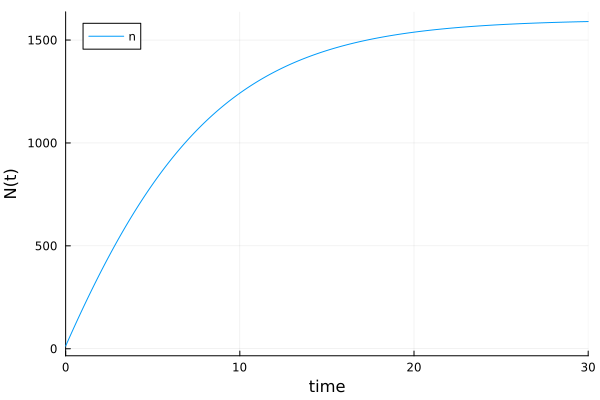
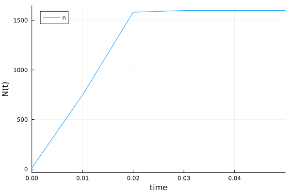

---
## Author
author:
  name: Вакутайпа Милдред
  degrees: BSc
  orcid: 009-0001-3145-3518
  email: 1032239009@rudn.ru
  affiliation:
    - name: Российский университет дружбы народов
      country: Российская Федерация
      postal-code: 117198
      city: Москва
      address: ул. Миклухо-Маклая, д. 6
## Title
title: Презентация по лабораторной работе №7
subtitle: Эффективность рекламы
license: CC BY
date: today
date-format: "YYYY-MM-DD" # Example: 2025-09-06
---

# Информация

## Докладчик

:::::::::::::: {.columns align=center}
::: {.column width="70%"}

  * Вакутайпа Милдред
  * НКНбд-01-23
  * кафедра математического моделирования и искусственого интеллекта
  * Российский университет дружбы народов им. П. Лумумбы
  * [1032239009@rudn.ru](mailto:1032239009@rudn.ru)
  * <https://yamadharma.github.io>

:::
::: {.column width="30%"}


:::
::::::::::::::

# Цель работы

Прводить симуляции и математическое моделирование для эффективности рекламы.

# Задание

Постройть график распространения рекламы, математическая модель которой описывается следующим уравнением:

1. $\dfrac{dn}{dt} = (0.12 + 0.000039n(t))(N - n(t))$
2. $\dfrac{dn}{dt} = (0.000012 + 0.29n(t))(N - n(t))$
3. $\dfrac{dn}{dt} = (0.12cos(t) + 0.000039cost(t)n(t))(N - n(t))$

При этом объем аудитории N = 1600 , в начальный момент о товаре знает 13 человек. Для случая 2 определите в какой момент времени скорость распространения рекламы будет иметь максимальное значение.

# Теоретическое введение

- Модель рекламной кампании описывается следующими величинами.
	- $\dfrac{dn}{dt}$ - скорость изменения со временем числа потребителей, узнавших о товаре и готовых его купить,
	- t - время, прошедшее с начала рекламной компании,(n)t - число уже информированных клиентов.  

- Эта велича пропорциональна числу покупателей, еще не знающих о нем, это описывается следующим образом: $\alpha_1(t)(N-n(t))$ 

-Помимо этого, узнавшие о товаре потребители также распространяют полученную информацию среди потенциальных покупателей.

## Теоретическое введение

-Математическая модель распространения рекламы описывается
уравнением:

$$ \dfrac{dn}{dt} = (\alpha_1(t) + \alpha_2(t)n(t))(N - n(t)) $$

- При $\alpha_1 >> \alpha_2$ получаем гиперболу, а при $\alpha_1 << \alpha_2$ получаем логическую кривую.

# Выполнение лабораторной работы

Для первого случая:

{#fig-001 width=70%}

## Выполнение лабораторной работы

Для второго случая:

``` julia

growth_rates = [f1(sol2.u[i], p2, sol2.t[i]) for i in 1:length(sol2.t)]
max_idx = argmax(growth_rates)
max_time = sol2.t[max_idx]

```

## Выполнение лабораторной работы

{#fig-001 width=70%}

## Выполнение лабораторной работы

Для третьего случая: 

{#fig-001 width=70%}

## Приложение 1

``` julia

f1(n, p, t) = (p[1]+p[2]*n)*(p[3]-n)
f2(n, p, t) = (p[1]*cos(t)+p[2]*cos(t)*n)*(p[3]-n)

```

## Приложение 1

``` julia

N = 1600
n = 13
p1 = [0.12, 0.000039, N]
p2 = [0.000012, 0.29, N]
p3 = [0.12, 0.29, N]
tspan = (0.0, 30.0)
tspan1 = (0.0, 0.03)
tspan2 = (0.0, 0.05) 

```

## Приложение 1

``` julia

q1 = ODEProblem(f1, n, tspan, p1)
q2 = ODEProblem(f1, n, tspan1, p2)
q3 = ODEProblem(f2, n, tspan2, p3)

sol = solve(q1, Tsit5(), saveat=0.01)
sol2 = solve(q2, Tsit5(), saveat=0.01)
sol3 = solve(q3, Tsit5(), saveat=0.01)

```

# Выводы

При выполнении работы я прводила симуляции и математическое моделирование для эффективности рекламы при двух разных условий.

