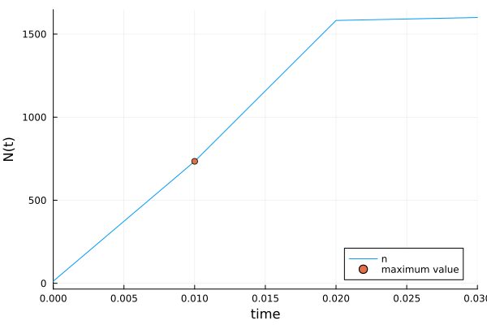

---
## Author
author:
  name: Вакутайпа Милдред
  degrees: BSc
  orcid: 009-0001-3145-3518
  email: kulyabov-ds@rudn.ru
  affiliation:
    - name: Российский университет дружбы народов
      country: Российская Федерация
      postal-code: 117198
      city: Москва
      address: ул. Миклухо-Маклая, д. 6

## Title
title: "Отчёт по лабораторной работе №7"
subtitle: "Эффективность рекламы"
license: "CC BY"
---

# Цель работы

Прводить симуляции и математическое моделирование для эффективности рекламы.

# Задание

Постройть график распространения рекламы, математическая модель которой описывается следующим уравнением:

1. $\dfrac{dn}{dt} = (0.12 + 0.000039n(t))(N - n(t))$
2. $\dfrac{dn}{dt} = (0.000012 + 0.29n(t))(N - n(t))$
3. $\dfrac{dn}{dt} = (0.12cos(t) + 0.000039cost(t)n(t))(N - n(t))$

При этом объем аудитории N = 1600 , в начальный момент о товаре знает 13 человек. Для случая 2 определите в какой момент времени скорость распространения рекламы будет иметь максимальное значение.

# Теоретическое введение

Модель рекламной кампании описывается следующими величинами.
Считаем, что $\dfrac{dn}{dt}$ - скорость изменения со временем числа потребителей, узнавших о товаре и готовых его купить,t - время, прошедшее с начала рекламной компании,(n)t - число уже информированных клиентов. Эта величина пропорциональна числу покупателей, еще не знающих о нем, это описывается следующим образом: $\alpha_1(t)(N-n(t))$ , где N - общее число потенциальных платежеспособных покупателей, $\alpha_1 (t)>0 $ - характеризует интенсивность рекламной кампании (зависит от затрат на рекламу в данный момент времени).

Помимо этого, узнавшие о товаре потребители также распространяют полученную информацию среди потенциальных покупателей, не знающих о нем (в этом случае работает т.н. сарафанное радио). Этот вклад в рекламу описывается величиной2 $\alpha_2(t)(N-n(t))$ , эта величина увеличивается с увеличением потребителей узнавших о товаре. Математическая модель распространения рекламы описывается
уравнением:

$$ \dfrac{dn}{dt} = (\alpha_1(t) + \alpha_2(t)n(t))(N - n(t)) $$

При $\alpha_1 >> \alpha_2$ получаем гиперболу, а при $\alpha_1 << \alpha_2$ получаем логическую кривую.

# Выполнение лабораторной работы

Я выполнила моделирование модели эффективности рекламы с помощью языка программирования julia (приложение 1). В первом случае, при $\alpha_1$ < $\alpha_2$,  получила модель Мальтуса ([рис. @fig-001]), которая используется для описания развития чего-то ,например развитие экономики, в условиях неограниченных ресурсов, где рост происходит геометрической прогрессией. 

{#fig-001 width=70%}

Во втором случае получила график, который быстро вырастет и станет стабильной. Я также нашла момент времени при котором корость распространения рекламы будет иметь максимальное значение и отметила его ([рис. @fig-002]). 

``` julia

growth_rates = [f1(sol2.u[i], p2, sol2.t[i]) for i in 1:length(sol2.t)]
max_idx = argmax(growth_rates)
max_time = sol2.t[max_idx]

```

{#fig-001 width=70%}

Также построила график для третьего случая ([рис. @fig-003]) 

{#fig-001 width=70%}

## Приложение 1

``` julia

using DifferentialEquations, Plots

f1(n, p, t) = (p[1]+p[2]*n)*(p[3]-n)
f2(n, p, t) = (p[1]*cos(t)+p[2]*cos(t)*n)*(p[3]-n)

N = 1600
n = 13
p1 = [0.12, 0.000039, N]
p2 = [0.000012, 0.29, N]
p3 = [0.12, 0.29, N]
tspan = (0.0, 30.0)
tspan1 = (0.0, 0.03)
tspan2 = (0.0, 0.05) 

q1 = ODEProblem(f1, n, tspan, p1)
q2 = ODEProblem(f1, n, tspan1, p2)
q3 = ODEProblem(f2, n, tspan2, p3)

sol = solve(q1, Tsit5(), saveat=0.01)
sol2 = solve(q2, Tsit5(), saveat=0.01)
sol3 = solve(q3, Tsit5(), saveat=0.01)

a = plot(sol, xlabel = "time", ylabel = "N(t)", label = "n")
savefig(a, "q1.png")

growth_rates = [f1(sol2.u[i], p2, sol2.t[i]) for i in 1:length(sol2.t)]
max_idx = argmax(growth_rates)
max_time = sol2.t[max_idx]
println(max_idx, " at time: ", max_time)
x = sol2.t[max_idx]
y = sol2.u[max_idx]

plot(sol2, xlabel = "time", ylabel = "N(t)", label = "n")
scatter!((x,y), leg =:bottomright, label = "maximum value")
savefig("q2.png")

c = plot(sol3, xlabel = "time", ylabel = "N(t)", label = "n")
savefig(c, "q3.png")

```

# Выводы

При выполнении работы я прводила симуляции и математическое моделирование для эффективности рекламы при двух разных условий.

# Список литературы{.unnumbered}

::: {#refs}
:::
