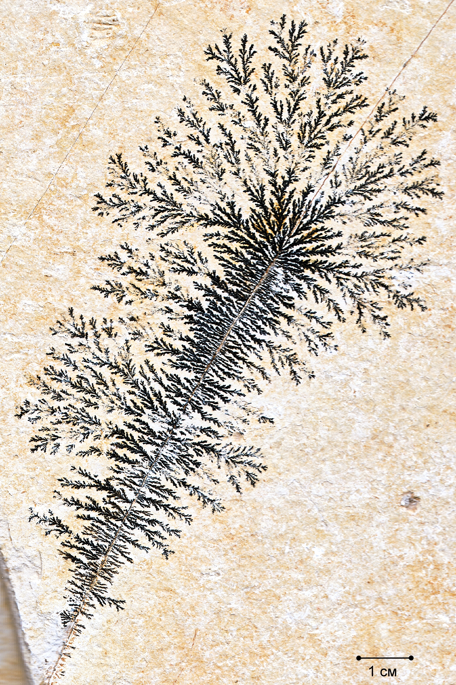

---
## Author
author:
  name: Вакутайпа Милдред, Разанацуа Сара Естэлл, Нджову Нелиа
  degrees: ВSc
  orcid: 0009-0001-3145-3518
  email: 1032239009@rudn.ru
  affiliation:
    - name: Российский университет дружбы народов
      country: Российская Федерация
      postal-code: 117198
      city: Москва
      address: ул. Миклухо-Маклая, д. 6
## Title
title: Презентация по росту дендритов
subtitle: Этап 1, Модель
license: CC BY
date: today
date-format: "YYYY-MM-DD" # Example: 2025-09-06
---

# Информация

## Докладчик

:::::::::::::: {.columns align=center}
::: {.column width="70%"}

  * Вакутайпа Милдред
  * НКНбд-01-23
  * студентка кафедры матеиатического моделирования и искуcственного интеkлекта
  * Российский университет дружбы народов им. П. Лумумбы
  * [1032239009@rudn.ru](mailto:1032239009@rudn.ru)
  * <https://wakutaipa.github.io/>

:::
::: {.column width="30%"}

:::
::::::::::::::

# Вводная часть

## Актуальность

- Процессы кристаллизации и роста дендритов играют ключевую роль в различных областях науки и техники
- Дендритная микроструктура, возникающая при неравновесном затвердевании, непосредственно влияет на распределение примесей, образование пор и трещин, а также на последующую термическую обработку материала.
- В природе дендритные структуры широко распространены

## Объект и предмет исследования

{#fig-001 width=60%}

## Цели и задачи

1. Построение численной модели роста дендритов
2. Учет физических механизмов, влияющих на рост
3. Исследование зависимости характеристик роста от параметров

# Теоретическое описание задачи

## Основные понятия и уравнения

## Тепловая диффузия

- Рост дендритов в переохлажденном расплаве определяется процессом отвода скрытой теплоты кристаллизации

$$
\rho c_p \frac{\partial T}{\partial t} = \kappa \nabla^2 T \equiv \kappa \left( \frac{\partial^2 T}{\partial x^2} + \frac{\partial^2 T}{\partial y^2} \right)
$$

## Условие Стефана

- Выделение скрытой теплоты кристаллизации
- Условие Стефана связывает скорость кристаллизации с разностью градиентов температуры

$$
\mathbf{n} \cdot \mathbf{V} = \frac{\kappa}{\rho L} \mathbf{n} \cdot (\nabla T|_s - \nabla T|_l)
$$

## Неустойчивость Муллинса – Секерки

- Основной причиной образования дендритных ветвей
- Плоская граница затвердевания является неустойчивой

## Эффект Гиббса – Томсона
- Соотношение Гиббса – Томсона:
$$
T_b = T_m \left( 1 - \frac{\gamma T_m}{\rho L^2 R} \right)
$$

- Капиллярный радиус:

$$
d_0 = \frac{\gamma T_m c_p}{\rho L^2}
$$

## Кинетическое переохлаждени

$$
\Delta T_b = -T_m \beta V
$$

## Безразмерная форма

Безразмерная температура определяется как:
$$
\tilde{T} = \frac{c_p (T - T_\infty)}{L}
$$

Параметр безразмерного переохлаждения:
$$
S = \frac{c_p (T_m - T_\infty)}{L}
$$

В безразмерной форме:
$$
\frac{\partial \tilde{T}}{\partial t} = \chi \nabla^2 \tilde{T}
$$

Эффект Гиббса – Томсона в безразмерной форме:
$$
T_b = \tilde{T}_m - \lambda \cdot (\text{член кривизны})
$$

# Описание модели

## Общая структура модели

- Модель реализуется на двумерной квадратной сетке размером $ N \times N $ узлов
- Расстояние между соседними узлами  h
- В центре области задается твердая затравка
- Каждый узел сетки может находиться в одном из двух состояний: жидком или твердом

## Численная схема для уравнения теплопроводности

- Лапласиан $\nabla^2 T$ в узле (i, j) аппроксимируется через значения температуры в соседних узлах:

$$
\nabla^2 T \approx \frac{\langle T_{(i,j)} \rangle - T_{i,j}}{(4 + 4w)(1 + 2w)h^2}
$$

- Среднее значение температуры соседей $\langle T_{(i,j)} \rangle$ вычисляется с учетом как ближайших, так и диагональных соседей:

$$
\langle T_{(i,j)} \rangle = \frac{ (T_{i+1,j} + T_{i-1,j} + T_{i,j+1} + T_{i,j-1}) + w (T_{i+1,j+1} + T_{i+1,j-1} + T_{i-1,j+1} + T_{i-1,j-1}) }{4 + 4w}
$$

- $0 \le w \le 1$  - вклад диагональных соседей

## Численная схема для уравнения теплопроводности

- Явная схема обновления температуры:

$$
T_{i,j}^{new} = T_{i,j} + \chi \Delta t \nabla^2 T
$$

- Для обеспечения устойчивости схемы и корректного учета разномасштабности
$$
T_{i,j}^{new} = T_{i,j} + \chi \frac{\Delta t}{m} \nabla^2 T
$$

- Условие устойчивости явной схемы:

$$
\frac{\chi \Delta t}{m h^2} < \frac{1}{4}
$$

## Дискретизация кривизны

- Для учета эффекта Гиббса – Томсона необходимо вычислять локальную кривизну границы

- Выражение для дискретизированной кривизны имеет вид:

$$
s_{i,j} = \sum_{\text{ближайшие}} n_{i,j} + w_n \sum_{\text{диагональные}} n_{i,j} - \left( \frac{5}{2} + \frac{5}{2} w_n \right)
$$

## Критерий затвердевания

- Условие затвердевания учитывает все физические механизмы:

$$
T \le \tilde{T}_m (1 + \eta_{i,j} \delta) + \lambda s_{i,j}
$$

## Параметры модели

- Размер сетки -- $N$ 
- Шаг сетки  -- $h$
- Шаг по времени  -- $\Delta t$
- Число подшагов  -- $m$
- Температуропроводность  -- $\chi$
- Переохлаждение  -- $\tilde{T}_m$
- Капиллярный параметр  -- $\lambda$
- Амплитуда шума  -- $\delta$
- Вес диагоналей  -- $w, w_n$

## Выводы

Во время выполнения первого этапа группового проекта мы:

- сделали теоретическое описание модели роста дендритов
- определили задачи дальнейшего исследования

:::
