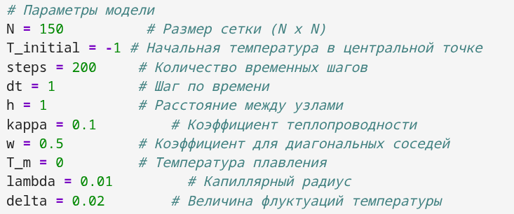
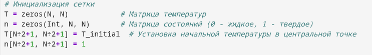
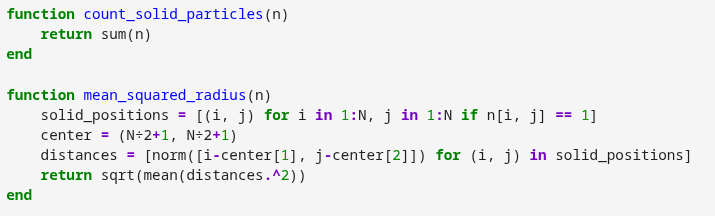
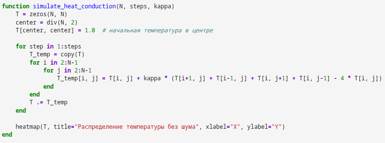
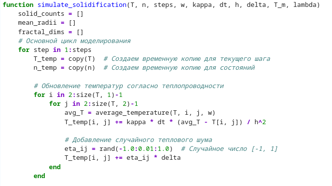
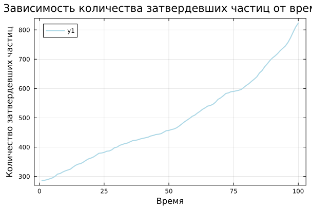
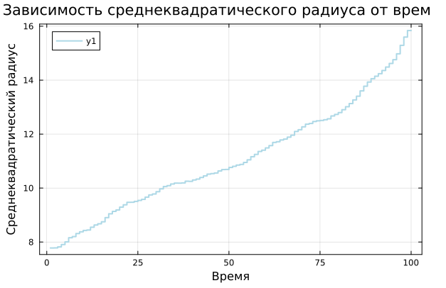

---
## Author
author:
  name: Вакутайпа Милдред, Разанацуа Сара Естэлл, Нджову Нелиа
  degrees: ВSc
  orcid: 0009-0001-3145-3518
  email: 1032239009@rudn.ru
  affiliation:
    - name: Российский университет дружбы народов
      country: Российская Федерация
      postal-code: 117198
      city: Москва
      address: ул. Миклухо-Маклая, д. 6
## Title
title: Презентация по росту дендритов
subtitle: Этап 4, Результаты проекта
license: CC BY
date: today
date-format: "YYYY-MM-DD" # Example: 2025-09-06
---

# Информация

## Докладчик

:::::::::::::: {.columns align=center}
::: {.column width="70%"}

  * Вакутайпа Милдред
  * НКНбд-01-23
  * студентка кафедры матеиатического моделирования и искуcственного интеkлекта
  * Российский университет дружбы народов им. П. Лумумбы
  * [1032239009@rudn.ru](mailto:1032239009@rudn.ru)
  * <https://wakutaipa.github.io/>

:::
::: {.column width="30%"}


:::
::::::::::::::

# Вводная часть

## Актуальность

- Процессы кристаллизации и роста дендритов играют ключевую роль в различных областях науки и техники
- Дендритная микроструктура, возникающая при неравновесном затвердевании, непосредственно влияет на распределение примесей, образование пор и трещин, а также на последующую термическую обработку материала.

## Объект и предмет исследования

- Дендриты
- Кристаллические дендриты


## Цели и задачи

1. Построить модель роста дендритов
2. Создать алгоритм модели роста дендритов 
3. Моделировать процесс с помощью языка программирования  

# Теоретическое описание задачи

## Тепловая диффузия

$$
\rho c_p \frac{\partial T}{\partial t} = \kappa \nabla^2 T \equiv \kappa \left( \frac{\partial^2 T}{\partial x^2} + \frac{\partial^2 T}{\partial y^2} \right)
$$

## Неустойчивость Муллинса – Секерки

- Основной причиной образования дендритных ветвей
- Плоская граница затвердевания является неустойчивой

## Эффект Гиббса – Томсона
- Соотношение Гиббса – Томсона:
$$
T_b = T_m \left( 1 - \frac{\gamma T_m}{\rho L^2 R} \right)
$$

- Капиллярный радиус:

$$
d_0 = \frac{\gamma T_m c_p}{\rho L^2}
$$


## Кинетическое переохлаждени

$$
\Delta T_b = -T_m \beta V
$$

## Безразмерная форма

Безразмерная температура определяется как:
$$
\tilde{T} = \frac{c_p (T - T_\infty)}{L}
$$

Параметр безразмерного переохлаждения:
$$
S = \frac{c_p (T_m - T_\infty)}{L}
$$

В безразмерной форме:
$$
\frac{\partial \tilde{T}}{\partial t} = \chi \nabla^2 \tilde{T}
$$

Эффект Гиббса – Томсона в безразмерной форме:
$$
T_b = \tilde{T}_m - \lambda \cdot (\text{член кривизны})
$$

# Описание модели

## Общая структура модели

- Модель реализуется на двумерной квадратной сетке размером $N \times N$ узлов
- Расстояние между соседними узлами  h
- В центре области задается твердая затравка
- Каждый узел сетки может находиться в одном из двух состояний: жидком или твердом

## Численная схема для уравнения теплопроводности

- Лапласиан $\nabla^2 T$ в узле (i, j) аппроксимируется через значения температуры в соседних узлах:

$$
\nabla^2 T \approx \frac{\langle T_{(i,j)} \rangle - T_{i,j}}{(4 + 4w)(1 + 2w)h^2}
$$

- Среднее значение температуры соседей $\langle T_{(i,j)} \rangle$ вычисляется с учетом как ближайших, так и диагональных соседей:

$$
\langle T_{(i,j)} \rangle = \frac{ (T_{i+1,j} + T_{i-1,j} + T_{i,j+1} + T_{i,j-1}) + w (T_{i+1,j+1} + T_{i+1,j-1} + T_{i-1,j+1} + T_{i-1,j-1}) }{4 + 4w}
$$

- $0 \le w \le 1$  - вклад диагональных соседей

## Численная схема для уравнения теплопроводности

- Явная схема обновления температуры:

$$
T_{i,j}^{new} = T_{i,j} + \chi \Delta t \nabla^2 T
$$

- Для обеспечения устойчивости схемы и корректного учета разномасштабности
$$
T_{i,j}^{new} = T_{i,j} + \chi \frac{\Delta t}{m} \nabla^2 T
$$

- Условие устойчивости явной схемы:

$$
\frac{\chi \Delta t}{m h^2} < \frac{1}{4}
$$

## Дискретизация кривизны

- Для учета эффекта Гиббса – Томсона необходимо вычислять локальную кривизну границы

- Выражение для дискретизированной кривизны имеет вид:

$$
s_{i,j} = \sum_{\text{ближайшие}} n_{i,j} + w_n \sum_{\text{диагональные}} n_{i,j} - \left( \frac{5}{2} + \frac{5}{2} w_n \right)
$$

## Критерий затвердевания

- Условие затвердевания учитывает все физические механизмы:

$$
T \le \tilde{T}_m (1 + \eta_{i,j} \delta) + \lambda s_{i,j}
$$


# Алгоритм

Алгоритм моделирования роста дендритов состоит из следующих основных этапов:

1. Запуск программы

2. Шаг 1: Настройка параметров модели

3. Шаг 2: Инициализация массивов и проверка условия остановки

4. Шаг 3: Расчет температурного поля

5. Шаг 4: Моделирование роста, сохранение результатов, возврат к проверке условия остановки, завершение моделирования

6. Шаг 5: Организация основного цикла вычислений

7. Шаг 6: Исследование зависимости характеристик роста от параметров
8. Шаг 7: Визуализация результатов

# Построение модели

## Задание базовых параметров моделирования

```Julia
N = 150          
T_initial = -1 
steps = 200     
dt = 1          
h = 1          
kappa = 0.1     
w = 0.5        
T_m = 0       
lambda = 0.01     
delta = 0.02    
```

## Инициализация сетки

```Julia
T = zeros(N, N)           
n = zeros(Int, N, N)  
T[N/2+1, N/2+1] = T_initial 
n[N/2+1, N/2+1] = 1
```

## Базовые функции

:::::::::::::: {.columns align=center}
::: {.column width="55%"}

  - Метод полиномиальной аппроксимации
  - Среднее значение температуры
  - Кривизна границы
  - Количества затвердевших частиц 
  - Среднеквадратичный радиус 
  
:::
::: {.column width="45%"}



:::
::::::::::::::

## Базовые функции

:::::::::::::: {.columns align=center}
::: {.column width="55%"}

  - Метод полиномиальной аппроксимации
  - Среднее значение температуры
  - Кривизна границы
  - Количества затвердевших частиц 
  - Среднеквадратичный радиус 
  
:::
::: {.column width="45%"}



:::
::::::::::::::

## Базовые функции

:::::::::::::: {.columns align=center}
::: {.column width="55%"}

  - Метод полиномиальной аппроксимации
  - Среднее значение температуры
  - Кривизна границы
  - Количества затвердевших частиц 
  - Среднеквадратичный радиус 
  
:::
::: {.column width="45%"}



:::
::::::::::::::

## Модель теплопроводности

:::::::::::::: {.columns align=center}
::: {.column width="30%"}


  
:::
::: {.column width="70%"}

Функция `simulate_heat_conduction` на основе уравнения обновления температуры:



:::
::::::::::::::

## Добавление процесса затвердевания

:::::::::::::: {.columns align=center}
::: {.column width="50%"}

Реализована функция `simulate_solidification`, которая выполняет следующие шаги:

1. Обновление температур
2. Проверка условия затвердевания
3. Обновление состояний
  
:::
::: {.column width="50%"}



:::
::::::::::::::


## Результаты моделирования. Исследование влияния капиллярного радиуса


## Динамика роста агрегата

:::::::::::::: {.columns align=center}
::: {.column width="50%"}


  
:::
::: {.column width="50%"}



:::
::::::::::::::

## Фрактальная размерность

:::::::::::::: {.columns align=center}
::: {.column width="40%"}


  
:::
::: {.column width="60%"}

Фрактальную размерность $D$ можно определить через логарифмическую регрессию:

$$ 
D = \frac{\log N(r)}{\log r} 
\tag{}
$$

где:

- $N(r)$ - количество частиц внутри радиуса $r$
- $D$ - искомая фрактальная размерность

Реализована функция `fractal_dimension`
:::
::::::::::::::

## Влияние теплового шума

:::::::::::::: {.columns align=center}
::: {.column width="33%"}


:::
::: {.column width="33%"}


:::
::::::::::::::

## Выводы

Во время выполнения группового проекта выполенеы следующие задания:

- описана модель роста дендритов
- описан алгоритм из 7 шагов для моделирования роста дендритов
- Смоделирован процесс теплопроводности.
- Исследовано влияние начального переохлаждения и капиллярного радиуса на форму дендритов.
- Проанализирована динамика роста агрегата и его фрактальная размерность.
- Изучено влияние теплового шума на морфологию агрегатов.

