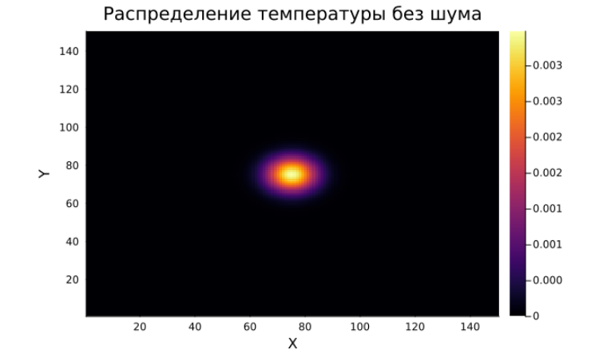
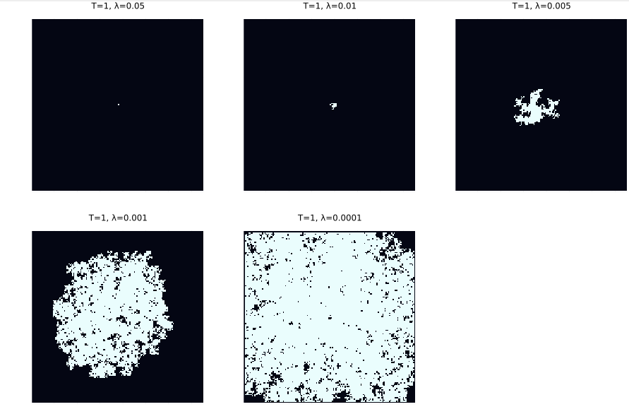
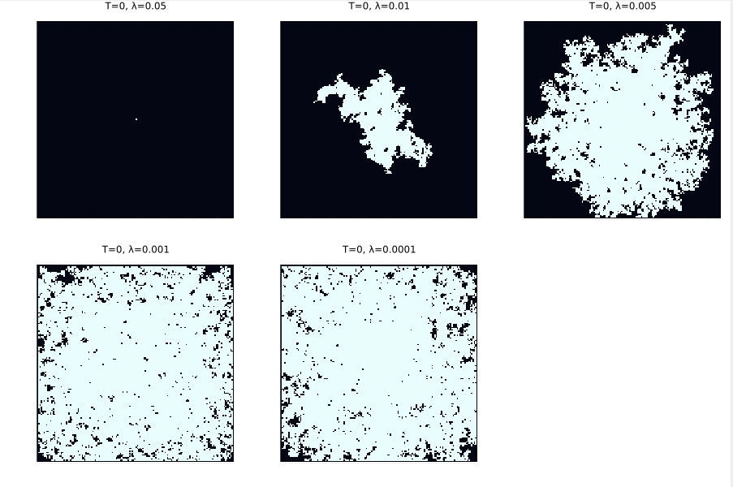
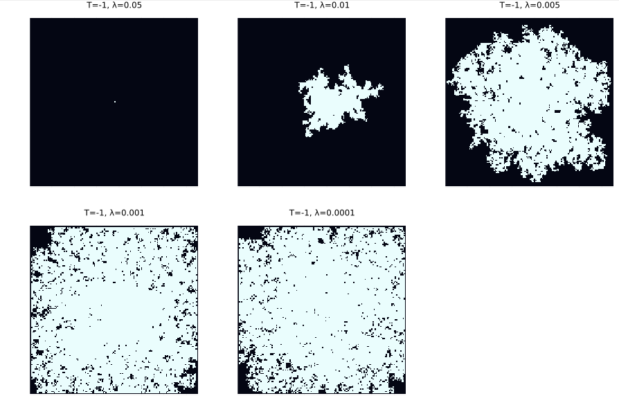
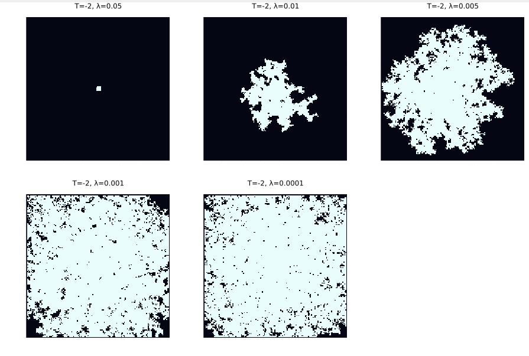
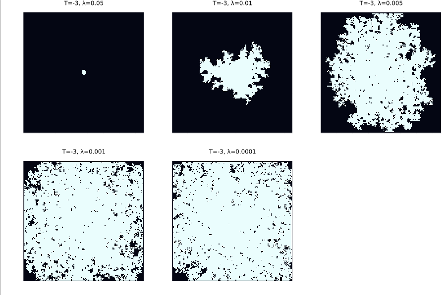
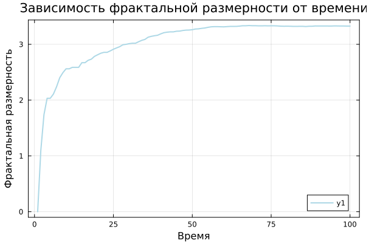
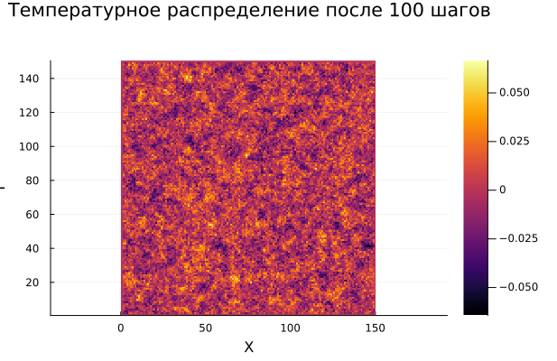
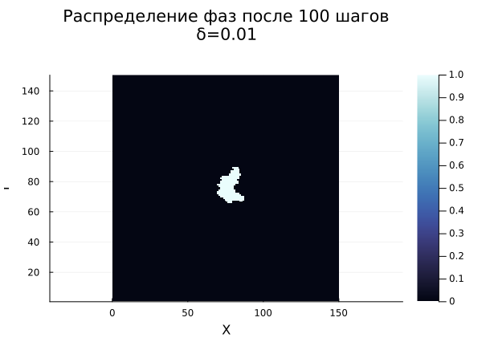
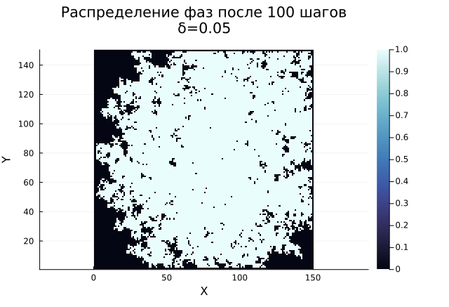

---
## Author
author:
  name: Вакутайпа Милдред, Разанацуа Сара Естэлл, Нджову Нелиа
  degrees: BSc
  orcid: 0009-0001-3145-3518
  email: 1032239009@rudn.ru
  affiliation:
    - name: Российский университет дружбы народов
      country: Российская Федерация
      postal-code: 117198
      city: Москва
      address: ул. Миклухо-Маклая, д. 6

## Title
title: "Групповой проект. Этап 4"
subtitle: "Результаты проекта. Самооценка деятельности"
license: "CC BY"
---

# Введение

## Актуальность

Дендрит - это характерная древовидная структура кристаллов, растущих по мере затвердевания расплавленного металла, форма, получаемая в результате более быстрого роста в энергетически выгодных кристаллографических направлениях.

Процессы кристаллизации и роста дендритов играют ключевую роль в различных областях науки и техники. В металлургии и материаловедении структура затвердевших металлов и сплавов, образующаяся в процессе литья, сварки и аддитивного производства, определяет их механические свойства — прочность, пластичность и усталостную долговечность. Дендритная микроструктура, возникающая при неравновесном затвердевании, непосредственно влияет на распределение примесей, образование пор и трещин, а также на последующую термообработку материала.


## Цель

Цель данной работы - смоделировать рост дендритов.

## Задачи

1. Построить модель роста дендритов
2. Создать алгоритм модели роста дендритов 
3. Моделировать процесс с помощью языка программирования 

# Теоретическое описание задачи

## Основные понятия и уравнения

### Тепловая диффузия

Рост дендритов в переохлажденном расплаве определяется процессом отвода скрытой теплоты кристаллизации. Эволюция температурного поля описывается уравнением теплопроводности. Для двумерного случая с постоянными теплофизическими свойствами (симметричная модель, в которой теплопроводность и плотность одинаковы для твердой и жидкой фаз) уравнение имеет вид:

$$
\rho c_p \frac{\partial T}{\partial t} = \kappa \nabla^2 T \equiv \kappa \left( \frac{\partial^2 T}{\partial x^2} + \frac{\partial^2 T}{\partial y^2} \right)
$$

где:
- $\rho$ — плотность вещества,
- $c_p$ — удельная теплоемкость при постоянном давлении,
- $T$ — температура,
- $t$ — время,
- $\kappa$ — коэффициент теплопроводности.

### Неустойчивость Муллинса – Секерки

Плоская граница затвердевания является неустойчивой. Если на границе возникает небольшой выступ, перед ним градиент температуры увеличивается, что приводит к ускоренному росту выступа. Этот механизм положительной обратной связи известен как неустойчивость Муллинса – Секерки и является основной причиной образования дендритных ветвей.

### Эффект Гиббса – Томсона

Рост выступов ограничивается поверхностным натяжением. На искривленной границе температура плавления понижается, что описывается соотношением Гиббса – Томсона:

$$
T_b = T_m \left( 1 - \frac{\gamma T_m}{\rho L^2 R} \right)
$$

где:
- $T_b$— температура на границе,
- $T_m$ — равновесная температура плавления для плоской границы,
- $\gamma$ — коэффициент поверхностного натяжения,
- $R$ — радиус кривизны (положительный для выпуклых участков).

Этот эффект вводит характерный масштаб длины — капиллярный радиус:

$$
d_0 = \frac{\gamma T_m c_p}{\rho L^2}
$$

### Кинетическое переохлаждение

Присоединение атомов к твердой поверхности не происходит мгновенно, что приводит к дополнительному переохлаждению границы, пропорциональному скорости роста:

$$
\Delta T_b = -T_m \beta V
$$

где $\beta$ — кинетический коэффициент.

### Безразмерная форма

Для удобства анализа вводятся безразмерные переменные. Безразмерная температура определяется как:

$$
\tilde{T} = \frac{c_p (T - T_\infty)}{L}
$$

где $T_\infty$ — начальная температура переохлажденного расплава.

Параметр безразмерного переохлаждения:

$$
S = \frac{c_p (T_m - T_\infty)}{L}
$$

В безразмерной форме уравнение теплопроводности сохраняет свой вид:

$$
\frac{\partial \tilde{T}}{\partial t} = \chi \nabla^2 \tilde{T}
$$

где $\chi = \kappa / \rho c_p $ — коэффициент температуропроводности.

Эффект Гиббса – Томсона в безразмерной форме вводит параметр $\lambda$, объединяющий поверхностное натяжение и кинетику:

$$
T_b = \tilde{T}_m - \lambda \cdot (\text{член кривизны})
$$

Тепловой шум учитывается добавлением случайной компоненты $\eta$ $\delta$ , где $\eta$ — равномерно распределенная случайная величина в интервале [-1, 1]\), а $\delta$ — амплитуда флуктуаций.

# Описание модели

## Общая структура модели

Модель реализуется на двумерной квадратной сетке размером $ N \times N $ узлов. Расстояние между соседними узлами по горизонтали и вертикали обозначается h. В центре области задается твердая затравка, от которой начинается рост дендрита. Каждый узел сетки может находиться в одном из двух состояний: жидком или твердом. Кроме того, каждому узлу сопоставлено значение безразмерной температуры.

## Численная схема для уравнения теплопроводности

Для решения уравнения теплопроводности используется явная конечно-разностная схема. Лапласиан $\nabla^2 T$ в узле (i, j) аппроксимируется через значения температуры в соседних узлах:

$$
\nabla^2 T \approx \frac{\langle T_{(i,j)} \rangle - T_{i,j}}{(4 + 4w)(1 + 2w)h^2}
$$

Среднее значение температуры соседей $\langle T_{(i,j)} \rangle$ вычисляется с учетом как ближайших, так и диагональных соседей:

$$
\langle T_{(i,j)} \rangle = \frac{ (T_{i+1,j} + T_{i-1,j} + T_{i,j+1} + T_{i,j-1}) + w (T_{i+1,j+1} + T_{i+1,j-1} + T_{i-1,j+1} + T_{i-1,j-1}) }{4 + 4w}
$$

Коэффициент $0 \le w \le 1$ определяет вклад диагональных соседей. В данной модели принимается $w = 1/2$.

Явная схема обновления температуры:

$$
T_{i,j}^{new} = T_{i,j} + \chi \Delta t \nabla^2 T
$$

Для обеспечения устойчивости схемы и корректного учета разномасштабности процессов тепловой диффузии и роста кристалла один шаг роста $\Delta t$ разбивается на $m$ подшагов для расчета теплопроводности:

$$
T_{i,j}^{new} = T_{i,j} + \chi \frac{\Delta t}{m} \nabla^2 T
$$

Условие устойчивости явной схемы:

$$
\frac{\chi \Delta t}{m h^2} < \frac{1}{4}
$$

## Дискретизация кривизны

Для учета эффекта Гиббса – Томсона необходимо вычислять локальную кривизну границы. В дискретной постановке кривизна аппроксимируется на основе количества твердых соседей у жидкого узла, граничащего с твердой фазой.

Выражение для дискретизированной кривизны имеет вид:

$$
s_{i,j} = \sum_{\text{ближайшие}} n_{i,j} + w_n \sum_{\text{диагональные}} n_{i,j} - \left( \frac{5}{2} + \frac{5}{2} w_n \right)
$$

где:
- первая сумма — по четырем ближайшим соседям (север, юг, запад, восток),
- вторая сумма — по четырем диагональным соседям,
- $n_{i,j} = 1$ , если соседний узел является твердым, и 0 в противном случае,
- $w_n$ — весовой коэффициент для диагональных соседей (принимается $w_n = 1/2$).

Значение $s_{i,j}$ отрицательно для выпуклых участков (вершин), что понижает локальную температуру плавления и способствует росту, и положительно для вогнутых участков (впадин), что подавляет рост.

## Критерий затвердевания

Жидкий узел, имеющий хотя бы один твердый сосед, может перейти в твердое состояние. Условие затвердевания учитывает все физические механизмы:

$$
T \le \tilde{T}_m (1 + \eta_{i,j} \delta) + \lambda s_{i,j}
$$

где:
- $T$ — текущая безразмерная температура жидкого узла,
- $\tilde{T}_m$ — безразмерная температура плавления (связана с параметром переохлаждения $S$),
- $\eta_{i,j}$ — случайное число, равномерно распределенное в интервале [-1, 1],
-$\delta$ — амплитуда теплового шума,
- $\lambda$ — параметр, объединяющий эффекты поверхностного натяжения и кинетического переохлаждения,
- $s_{i,j}$ — дискретизированный член кривизны.

При затвердевании узла его состояние изменяется с жидкого на твердое, а температура увеличивается на 1 единицу для учета выделения скрытой теплоты кристаллизации.

## Параметры модели

| Параметр | Обозначение | Физический смысл | Диапазон / Типичное значение |
|----------|-------------|------------------|------------------------------|
| Размер сетки  | $N$ | Количество узлов по каждому измерению | 100–500 |
| Шаг сетки  | $h$ | Расстояние между узлами | 1 (единица длины) |
| Шаг по времени  | $\Delta t$ | Временной интервал одного шага роста | 1 (единица времени) |
| Число подшагов  | $m$ | Количество подшагов тепловой диффузии | 10–100 |
| Температуропроводность  | $\chi$ | Скорость тепловой диффузии | 0.1–0.5 |
| Переохлаждение  | $\tilde{T}_m$ | Безразмерная температура плавления | 0.1–0.9 |
| Капиллярный параметр  | $\lambda$ | Интенсивность стабилизации границы | 0.01–0.5 |
| Амплитуда шума  | $\delta$ | Уровень тепловых флуктуаций | 0–0.2 |
| Вес диагоналей  | $w, w_n$ | Вклад диагональных соседей | 0.5 |

: Описание параметров модели {#tbl-std-dir}

# Алгоритм

## Шаг 1: Настройка параметров модели

Первый этап включает в себя определение физических свойств материала и вычислительных параметров для моделирования. Корректность входных данных определяет надежность всего процесса моделирования.

### Физические свойства материала:

- Плотность $\rho$: определяет массу на единицу объема материала.
- Удельная теплоемкость $c_p$: количество энергии, необходимо для нагрева единицы массы на один градус.
- Скрытая теплота плавления $L$: энергия фазавого перехода
- Теплопроводность $\kappa$: способность материала передавать тепловую энергию
- Коэффициент температуропроводности $\chi = \kappa/(\rho c_p)$: скорость выравнивания температурного градиента
- Температура плавления $T_m$: критическая точка фазового перехода
- Коэффициент поверхностного натяжения $\gamma$: влияет на стабильность границы раздела фаз
- Кинетический коэффициент $\beta$: характеризует скорость прикрепления атомов к поверхности кристалла[1,2]

### Вычислительные параметры

- Размер сетки $N \times N$: Количество узлов по каждому измерению
- Пространственный шаг $h$: Расстояние между соседними узлами
- Временной шаг роста $\Delta$: Интервал одного шага роста
- Число подшагов $m$: Количество подшагов тепловой диффузии
- Капиллярный параметр $\lambda$: Интенсивность стабилизации границы
- Амплитуда шума $\delta$: Уровень тепловых флуктуаций[3]

### Начальные и граничные условия:

- Начальная температура расплава $T_\infty$: определяет степень переохлаждения системы
- Безразмерное переохлаждение $S = c_p (T_m - T_\infty)/L$: ключевой параметр термодинамической готовности системы
- Граничные условия: постоянная температура на всех границах расчетной области, равная начальной температуре расплава $T_\infty$[4] 

## Шаг 2: Инициализация структур данных

На втором этапе создаются структуры данных для хранения состояния системы и задается начальная конфигурация.

### Структуры данных:

Создаются два двумерных массива размером $N \times N$:

1. Массив фазового состояния $phase[i][j]$:

- $phase[i][j] = 1$ — твердая фаза
- $phase[i][j] = 0$ — жидкая фаза

2. Массив безразмерной температуры $T[i][j]$:

- Хранит текущее значение безразмерной температуры в каждом узле

### Инициализация:

1. Заполнение массивов начальными значениями:

- Все узлы: $phase[i][j] = 0$ (жидкое состояние)
- Все узлы: $T[i][j] = 0$ (безразмерная температура расплава)

2. Создание затравки кристаллизации:

- В центральной области сетки задается твердая затравка (например, квадрат $5 \times 5$ узлов)
- Для узлов затравки: $phase[i][j] = 1$ (твердое состояние)
- Для узлов затравки: $T[i][j] = \tilde{T}_m$ (безразмерная температура плавления)

## Шаг 3: Расчет температурного поля

Третий шаг реализует численное решение уравнения теплопроводности для расчета эволюции температурного поля.[3]

### Дискретизация уравнения теплопроводности:

Используется явная конечно-разностная схема. Лапласиан в узле $(i,j)$ аппроксимируется с учетом ближайших и диагональных соседей:

$$
\nabla^2 T \approx \frac{\langle T_{(i,j)} \rangle - T_{i,j}}{(4 + 4w)(1 + 2w)h^2}
$$

где среднее значение температуры соседей:

$$
\langle T_{(i,j)} \rangle = \frac{ (T_{i+1,j} + T_{i-1,j} + T_{i,j+1} + T_{i,j-1}) + w (T_{i+1,j+1} + T_{i+1,j-1} + T_{i-1,j+1} + T_{i-1,j-1}) }{4 + 4w}
$$

Коэффициент $w = 1/2$ определяет вклад диагональных соседей.[4]

### Алгоритм расчета тепловой диффузии:

Для каждого шага роста $\Delta t$ выполняется $m$ подшагов тепловой диффузии:

1. Для каждого узла сетки $(i, j)$ вычислить лапласиан $\nabla^2 T_{i,j}$ по приведенной формуле

2. Обновить температуру: $T_{i,j}^{new} = T_{i,j} + \chi \frac{\Delta t}{m} \nabla^2 T_{i,j}$

3. Применить граничные условия постоянной температуры: $T_{граница} = 0$

### Условие устойчивости:

$$
\frac{\chi \Delta t}{m h^2} < \frac{1}{4}
$$

## Шаг 4: Моделирование роста дендритов

На четвертом этапе после завершения всех подшагов тепловой диффузии выполняется проверка условий затвердевания и обновление фазового состояния.

### Порядок обновления:

Важной особенностью алгоритма является последовательное обновление:

1. Сначала полностью рассчитывается температурное поле на текущем шаге (все $m$ подшагов)

2. Затем, на основе полученного температурного поля, проверяются условия затвердевания

### Вычисление кривизны границы:

Для жидкого узла, имеющего хотя бы один твердый сосед, вычисляется дискретизированная кривизна:[3]

$$
s_{i,j} = \sum_{\text{nearest}} n_{i,j} + w_n \sum_{\text{diagonal}} n_{i,j} - \left( \frac{5}{2} + \frac{5}{2} w_n \right)
$$

где:

- $n_{i,j} = 1$ если соседний узел твердый, и $0$ в противном случае
- $w_n = 1/2$ — весовой коэффициент для диагональных соседей
- $s_{i,j} < 0$ для выпуклых участков (вершин), $s_{i,j} > 0$ для вогнутых

### Критерий затвердевания:

Жидкий узел переходит в твердое состояние, если выполняется условие:

$$
T_{i,j} \le \tilde{T}_m + \lambda s_{i,j} + \eta_{i,j} \delta
$$

где:

- $\tilde{T}_m$ — безразмерная температура плавления
- $\lambda$ — капиллярный параметр, объединяющий эффекты Гиббса–Томсона и кинетического переохлаждения[2]
- $s_{i,j}$ — дискретизированная кривизна

- $\eta_{i,j}$ — случайное число из равномерного распределения $[-1, 1]$
- $\delta$ — амплитуда теплового шума[3]

### Алгоритм проверки затвердевания:

1. Полный обход всех узлов сетки $(i, j)$

2. Для каждого узла:

- Если $phase[i][j] = 1$ (твердый), пропустить
- Если $phase[i][j] = 0$ (жидкий), проверить наличие твердых соседей
- Если твердые соседи отсутствуют, пропустить
- Если твердые соседи есть:
  - Вычислить $s_{i,j}$ на основе соседних узлов
  - Сгенерировать случайное число $\eta_{i,j}$
  - Проверить критерий затвердевания
  - Если условие выполнено:
    - $phase[i][j] = 1$ (переход в твердое состояние)
    - $T[i][j] = T[i][j] + 1$ (выделение скрытой теплоты)[3]

## Шаг 5: Организация основного цикла вычислений

Пятый этап описывает структуру основного вычислительного цикла.

### Блок-схема алгоритма:

Алгоритм моделирования роста дендритов состоит из следующих основных этапов:

1. Начало: Запуск программы

2. Шаг 1: Настройка параметров модели

- Определение физических свойств материала (ρ, c_p, κ, L, T_m, γ, β)
- Определение вычислительных параметров (N, h, Δt, m, λ, δ)
- Определение начальных и граничных условий (T_∞, T_граница = T_∞)

3. Шаг 2: Инициализация массивов

- Создание массива фазового состояния phase[N][N] (все узлы = 0 — жидкие)
- Создание массива температуры T[N][N] (все узлы = 0)
- Создание твердой затравки в центре (phase = 1, T = T̃_m)

4. Проверка условия остановки

- Если дендрит достиг границы → переход к завершению
- Если не достиг → продолжение вычислений

5. Шаг 3: Расчет температурного поля

- Выполнение m подшагов тепловой диффузии:
  - Для каждого узла вычислить лапласиан ∇²T
  - Обновить температуру T_new = T + χ·(Δt/m)·∇²T
  - Применить граничные условия T_граница = 0

6. Шаг 4: Моделирование роста

- Обход всех узлов сетки:
  - Для каждого жидкого узла с твердыми соседями:
    - Вычислить кривизну s_ij
    - Сгенерировать случайный шум η_ij
    - Проверить критерий затвердевания: T ≤ T̃_m + λ·s_ij + η·δ
    - Если условие выполнено:
      - phase[i][j] = 1 (переход в твердое состояние)
      - T[i][j] = T[i][j] + 1 (выделение скрытой теплоты)

7. Сохранение результатов

- Запись фазового и температурного полей для визуализации

8. Возврат к проверке условия остановки (пункт 4)

9. Конец: Завершение моделирования

### Условие остановки:

Вычисления продолжаются до тех пор, пока дендрит не достигнет границы расчетной области. Условие проверяется после каждого шага роста: если любой твердый узел находится на границе сетки, моделирование завершается.

## Шаг 6: Исследование зависимости характеристик роста от параметров

На шестом этапе выполняются серии расчетов для анализа влияния ключевых параметров на морфологию дендритов.[1]

### Параметры для исследования:

| Параметр | Диапазон | Исследуемый эффект |
|----------|----------|-------------------|
| Переохлаждение $\tilde{T}_m$ | 0.1–0.9 | Скорость роста, плотность ветвления |
| Капиллярный параметр $\lambda$ | 0.01–0.5 | Стабилизация границы, радиус вершины |
| Амплитуда шума $\delta$ | 0–0.2 | Вторичное ветвление, симметрия |
| Температуропроводность $\chi$ | 0.1–0.5 | Скорость отвода тепла |

### Анализируемые характеристики:

1. Скорость роста вершины: измеряется как смещение фронта во времени

2. Радиус кривизны вершины: определяется по конфигурации твердой фазы

3. Плотность вторичных ветвей: количество ответвлений на единицу длины

4. Время достижения границы: полное время моделирования до остановки

### Методика проведения исследований:

1. Зафиксировать все параметры, кроме исследуемого

2. Выполнить серию расчетов с различными значениями исследуемого параметра

3. Для каждого расчета сохранить:

- Финальную морфологию дендрита
- Зависимость скорости роста от времени
- Время достижения границы

4. Построить графики зависимостей характеристик от параметров

## Шаг 7: Визуализация результатов

Седьмой этап обеспечивает графическое представление процесса роста и финальных результатов.

### Визуализация в процессе моделирования:

На каждом шаге роста (или с заданной периодичностью) сохраняются:

1. Фазовое поле: отображение твердой (например, черный) и жидкой (белый) фаз

2. Температурное поле: цветовая карта распределения безразмерной температуры

### Финальная визуализация:

По завершении моделирования:

- Построение финальной морфологии дендрита
- Создание анимации процесса роста на основе сохраненных кадров
- Построение графиков зависимостей (скорость роста от времени, влияние параметров)

# Практическая часть

## Определение параметров и базовых функций

Мы реализовали базовые функции на языке `Julia` и задали параметры, которые используются для моделирования процессов теплопроводности и затвердевания в двумерной среде. Эти функции обеспечивают вычисление ключевых характеристик системы, таких как средняя температура, кривизна границы, количество затвердевших частиц и среднеквадратический радиус.

### Параметры модели

Модель использует следующие параметры:

- Размер сетки: $N = 150$ матрица $N \times N$

- Начальная температура (в центральной точке): $( T_{\text{initial}} = -1 )$

- Количество временных шагов: $\text{steps} = 200 $

- Шаг по времени: $\Delta t = 1$

- Расстояние между узлами: $h = 1$

- Коэффициент теплопроводности: $\kappa = 0.1$

- Коэффициент для диагональных соседей: $w = 0.5$

- Температура плавления: $T_m = 0$

- Капиллярный радиус: $\lambda = 0.01$

- Величина флуктуаций температуры: $\delta = 0.02$

### Инициализация сетки

Для моделирования создается двумерная сетка:

- Матрица температур $T$: 
    Инициализируется нулями, за исключением центральной точки, где устанавливается начальная температура $T_{\text{initial}} = -1$

- Матрица состояний $n$: 
    Инициализируется нулями (жидкая фаза), за исключением центральной точки, которая сразу затвердевает $n = 1$.
    
```Julia
# Инициализация сетки
T = zeros(N, N)           
n = zeros(Int, N, N)      
T[N÷2+1, N÷2+1] = T_initial 
n[N÷2+1, N÷2+1] = 1
```

### Базовые функции

#### Вычисление среднего значения температуры

Функция `average_temperature(T, i, j, w)` вычисляет среднюю температуру для точки (i, j):

```Julia
function average_temperature(T, i, j, w)
    horizontal_vertical_neighbors = [
        T[i-1, j], T[i+1, j], T[i, j-1], T[i, j+1]
    ]
    diagonal_neighbors = [
        T[i-1, j-1], T[i-1, j+1], T[i+1, j-1], T[i+1, j+1]
    ]
    avg = sum(horizontal_vertical_neighbors) + w * sum(diagonal_neighbors)
    return avg / (4 + 4*w)
end
```

#### Вычисление кривизны границы

Функция `curvature(n, i, j, w)` вычисляет кривизну границы для точки (i, j):

```Julia
function curvature(n, i, j, w)
    horizontal_vertical_neighbors = [
        n[i-1, j], n[i+1, j], n[i, j-1], n[i, j+1]
    ]
    diagonal_neighbors = [
        n[i-1, j-1], n[i-1, j+1], n[i+1, j-1], n[i+1, j+1]
    ]
    sum_hv = sum(horizontal_vertical_neighbors)
    sum_diag = w * sum(diagonal_neighbors)
    return sum_hv + sum_diag - (5/2 + 5/2 * w)
end
```

#### Подсчет количества затвердевших частиц

Функция count_solid_particles(n) подсчитывает количество затвердевших частиц:

```Julia
function count_solid_particles(n)
    return sum(n)
end
```

#### Вычисление Среднеквадратического Радиуса

Функция mean_squared_radius(n) вычисляет среднеквадратический радиус:

```Julia
unction mean_squared_radius(n)
    solid_positions = [(i, j) for i in 1:N, j in 1:N if n[i, j] == 1]
    center = (N÷2+1, N÷2+1)
    distances = [norm([i-center[1], j-center[2]]) for (i, j) in solid_positions]
    return sqrt(mean(distances.^2))
end
```

## Модель Теплопроводности

### Реализация

Была написана функция `simulate_heat_conduction`. Она включает следующие этапы:

1. **Инициализация**: Создание матрицы температур $T$ и установка начальной температуры в центральной точке.

2. **Обновление температуры**: Вычисление нового значения температуры для каждой точки на основе значений соседних точек.

3. **Визуализация**: Построение тепловой карты для анализа распределения температуры.

```Julia
function simulate_heat_conduction(N, steps, $\kappa$)
    T = zeros(N, N)
    center = div(N, 2)
    T[center, center] = 1.0 
    for step in 1:steps
        T_temp = copy(T)
        for i in 2:N-1
            for j in 2:N-1
                T_temp[i, j] = T[i, j] + $\kappa$ * (T[i+1, j] + T[i-1, j] + T[i, j+1] + T[i, j-1] - 4 * T[i, j])
            end
        end
        T .= T_temp
    end

    heatmap(T, title="Распределение температуры без шума", xlabel="X", ylabel="Y")
end
```

### Результаты

 Результаты (рис. 1)

{#fig:001 width=70%}

**Анализ**:

- Наблюдается четкая радиальная симметрия.
- Центральная точка остается наиболее холодной областью.
- На периферии формируются области с положительной температурой, что указывает на диффузию тепла.

### Условие Фазового Перехода

Точка переходит в твердую фазу, если выполняется условие:

$$
T \leq \tilde{T}_m (1 + \eta_{i,j} \delta) + \lambda s_{i,j}
$${#eq:eq:q}

где:

- $T$ - текущая температура узла

- $\tilde{T}_m$ - безразмерная температура плавления (с учетом начального переохлаждения)

- $\eta_{i,j}$ - случайный шумовой параметр

- $\delta$ - амплитуда теплового шума

- $\lambda$ - эффективный капиллярный радиус

- $s_{i,j}$ - параметр, связанный с кривизной границы

### Реализация

Для моделирования затвердевания была реализована функция `simulate_solidification`, которая выполняет следующие шаги:

1. **Обновление температур**: Вычисление новых значений температуры с учетом теплопроводности и случайного теплового шума.
2. **Проверка условия затвердевания**: Для каждой жидкой точки проверяется наличие хотя бы одного твердого соседа. Если условие выполнено, точка затвердевает.
3. **Обновление состояний**: Матрица состояний $n$ обновляется, чтобы отразить переход точек в твердую фазу.

```Julia
function simulate_solidification(T, n, steps, w, kappa, dt, h, $\delta$, T_m, $\lambda$)
    solid_counts = []
    mean_radii = []
    fractal_dims = []
    for step in 1:steps
        T_temp = copy(T)
        n_temp = copy(n) 
        for i in 2:size(T, 1)-1
            for j in 2:size(T, 2)-1
                avg_T = average_temperature(T, i, j, w)
                T_temp[i, j] += kappa * dt * (avg_T - T[i, j]) / h^2
                $\eta$_ij = rand(-1.0:0.01:1.0) 
                T_temp[i, j] += $\eta$_ij * $\delta$
            end
        end
        for i in 2:size(n, 1)-1
            for j in 2:size(n, 2)-1
                if n[i, j] == 0
                    neighbors = [n[i-1, j], n[i+1, j], n[i, j-1], n[i, j+1],
                                 n[i-1, j-1], n[i-1, j+1], n[i+1, j-1], n[i+1, j+1]]
                    if any(neighbors .== 1)
                        s_ij = curvature(n, i, j, w)
                        local_T_m = T_m + $\lambda$ * s_ij
                        if T_temp[i, j] <= local_T_m
                            n_temp[i, j] = 1 
                            T_temp[i, j] += 1
                        end
                    end
                end
            end
        end

        T .= T_temp
        n .= n_temp
        push!(solid_counts, count_solid_particles(n))
        push!(mean_radii, mean_squared_radius(n))

        D, log_rs, log_Ns = fractal_dimension(n)
        push!(fractal_dims, D)
    end

    return solid_counts, mean_radii, fractal_dims
end
```

### Исследование влияния начального переохлаждения и величины капилярного радиуса

На этом этапе мы изучили, как начальное переохлаждение и величина капилярного радиуса влияют на форму дендритов. Для этого был взят набор значений начального переохлаждения [1, 0, -1, -2, -3] и набор значений капилярного радиуса: [0.05, 0.01, 0.005, 0.001, 0.0001].

Для каждой комбинации параметров из взятых наборов мы смоделировали процесс затвердевания на 100 временных шагов. Результаты представлены группами объединенными по значению начального переохлаждения: 1 (рис.2), 0 (рис.3), -1 (рис.4) , -2 (рис.5) , -3 (рис.6) .

{#fig:002 width=99%}

{#fig:003 width=99%}

{#fig:004 width=99%}

{#fig:005 width=99%}

{#fig:006 width=99%}

Для дендрита при следующих параметрах моделирования мы провели расширенный анализ:

- Временные параметры: Результат после 100 шагов моделирования
  - Начальные условия:
  - Начальная температура $(T_initial) = 0$ (во всех точках кроме центра) 
  - Капиллярный радиус $\lambda = 0.001$  

1. Форма роста:
   - Четко выраженные ветвистые структуры
   - Асимметричное развитие в вертикальном направлении
   - Характерные вторичные ветвления

2. Размерные соотношения:
   - Основные ветви достигают ~60% максимального радиуса

3. Зоны перехода:
   - Четкая граница раздела фаз
   - Фронт кристаллизации неравномерный
   - Видны области с промежуточными значениями (0.2-0.8) - зоны частичного затвердевания

## Динамика роста агрегата

### Зависимость числа частиц от времени

- **Начальная стадия $( t \to 0 )$**: $( N \sim t )$ (линейный рост).

- **Поздняя стадия $( t \to \infty )$**: $( N \sim t^\alpha )$, где $( \alpha < 1 )$.

График зависимости числа затвердевших частиц от времени (рис. [-@fig:007]): 

{#fig:007 width=70%}

#### Анализ

**Основные характеристики графика**

Кривая роста:

- Начальное условие: 290 частиц при $t=0$

**Детальный анализ динамики** в табл. 

Фазы кристаллизации:

| Временной интервал | Характер роста   | Описание процесса         |
|--------------------|------------------|---------------------------|
| 0-50 шагов         | Линейный         | Стабильный рост.          |
| 50-75 шагов        | Равномерный      | Плотность ветвления       |
| 75-100 шагов       | Ускоренный       | Кривая идет круче вверх   |

### Среднеквадратический Радиус

- Диффузионный режим: $(Rg \sim  \sqrt{t})$

- Режим ограниченного роста: $(Rg \sim ln(t))$

График зависимости среднеквадратического радиуса от времени (рис.8):

{#fig:008 width=70%}

## Фрактальная Размерность

### Определение Фрактальной Размерности

Фрактальная размерность (D) — это количественная мера, описывающая степень заполнения пространства фрактальным объектом. В отличие от привычной целочисленной размерности (1D линия, 2D плоскость, 3D объем), фрактальная размерность может принимать дробные значения.

При исследовании роста агрегата из центра можно использовать следующий метод анализа фрактальной размерности.

**Основная зависимость**

Число частиц в кластере $N$ связано с характерным радиусом $R_{ch}$ соотношением :

$$ 
N \propto R_{ch}^D 
$$

где D - фрактальная размерность.

**Характерные радиусы**

Для анализа можно использовать:

1. Максимальный радиус  $R_{max} = \max(r_i)$ 
   где $r_i$ - расстояния частиц от центра.

2. Радиус гирации (более точный метод):  $R_g = \sqrt{\langle r^2 \rangle}$ 

   Связан с моментом инерции кластера:   $N R_g^2 = \sum_{i=1}^N r_i^2$

**Расчет фрактальной размерности**

Фрактальную размерность D можно определить через логарифмическую регрессию:

$$ 
D = \frac{\log N(r)}{\log r} 
$$

где:

- $N(r)$ - количество частиц внутри радиуса $r$
- $D$ - искомая фрактальная размерность

1. Создание списка радиусов:

   - Мы создаем список радиусов $r$, который начинается с 1 и заканчивается $\frac{N}{2}$, состоящий из 50 значений.

2. Подсчет количества точек внутри круга радиуса $r$:

   - Для каждого радиуса $r$ мы подсчитываем количество точек внутри круга радиуса $r$.
   
   - Для каждой точки массива $n$ проверяем, является ли она затвердевшей частицей и находится ли она внутри круга радиуса $r$, используя норму
   
   $$
   \sqrt{(i - \frac{N}{2} - 1)^2 + (j - \frac{N}{2} - 1)^2}
   $${#eq:eq:o}
   
   - Если точка удовлетворяет этим условиям, увеличиваем счетчик на 1.
   
   - Добавляем количество точек для каждого радиуса $r$ в список $Ns$.

3. Построение графика:

   - Вычисляем логарифмы радиусов $r$ и количества точек $N(r)$.
   
   - Строим график зависимости $\log(N(r))$ от $\log(r)$.

4. Линейная регрессия:

   - Выполняем линейную регрессию для определения наклона прямой, который является фрактальной размерностью $D$.
   
   - Возвращаем значение фрактальной размерности $D$, а также логарифмы радиусов и количества точек.
   
### Иссиледование зависимости фрактальной размерности от времени

Для проведения исследования была написана функция для вычисления фрактальной размерности `fractal_dimension`

- D = 1.0-1.3: Линейные цепочки 

- D = 1.4-1.6: Разветвленные дендриты (типично для DLA) 

- D > 1.7: Плотные фракталы (при сильном переохлаждении) 

Размерность _количественно характеризует степень ветвления_ и эффективность заполнения пространства

```
function fractal_dimension(n)
    rs = range(1, stop=N÷2, length=50)
    Ns = []

    for r in rs
        count = 0
        for i in 1:N
            for j in 1:N
                if n[i, j] == 1 && norm([i-N÷2-1, j-N÷2-1]) <= r
                    count += 1
                end
            end
        end
        push!(Ns, count)
    end

    log_rs = log.(rs)
    log_Ns = log.(Ns)

    
    fit = polyfit(log_rs, log_Ns, 1)
    D = fit[1]

    return D, log_rs, log_Ns
end
```

График зависимости фрактальной размерности от времени (рис.9):

{#fig:009 width=70%}

#### Анализ

1. Инициальная фаза (t=0-10):

   - Резкий рост от D≈0 до D≈1.5
   
   - Образование первичных дендритных ветвей

2. Фаза ветвления (t=10-40):

   - Плавный рост до D≈2.2-2.5
   
   - Формирование сложной иерархической структуры

3. Фаза насыщения (t>40):

   - Стабилизация на D≈2.7-2.9
   
   - Плотное заполнение пространства

## Влияние Теплового Шума

Тепловой шум оказывает значительное влияние на формирование дендритов, поэтому мы провели исследование, где смоделировали и проанализировали рост дендритов при различных значениях теплового шума ($\delta$)

- ($\delta$) < 0.01: Регулярные симметричные дендриты 

- 0.01 < ($\delta$) < 0.1: Умеренное ветвление с шероховатостью 

- ($\delta$) > 0.1: 

  - Потеря ориентационной упорядоченности 
  
  - Образование пористых агрегатов 
  
  - Возникновение "фрактального хаоса" 

Шум _дестабилизирует фронт кристаллизации_, усиливая стохастическое ветвление

### Температурное распределение

График температурного распределения после 100 шагов (рис.10):

{#fig:010 width=70%}


### Эксперименты с изменением теплового шума

Были проведены три эксперимента с различными значениями теплового шума $\delta$:

- $\delta$ = 0.01: регулярные симметричные дендриты рис. 10.

- $\delta$ = 0.05: умеренное ветвление с шероховатостью рис. 11.

- $\delta$ = 0.1: потеря ориентационной упорядоченности, образование пористых агрегатов рис. 12.

{#fig:011 width=70%}

{#fig:012 width=70%}

{#fig:013 width=70%}

#### Анализ

Описали разницу в росте дендритных структур в таблице.

Сравнительная характеристика:

| Параметр                | $(\delta)=0.01$ (слабый шум)       | $(\delta)=0.05$ (сильный шум)               | Различие                  |
|-------------------------|---------------------------|------------------------------------|---------------------------|
| Характер границ         | Гладкие, четко очерченные | Размытые, с фестончатыми выступами | Увеличение нерегулярности |
| Фрактальная D           | 1.61±0.02                 | 1.72±0.04                          | +6.8%                     |
| Скорость роста          | 0.12±0.01 ед/шаг          | 0.18±0.03 ед/шаг                   | +50%                      |

**Шероховатость границ:**

- ($\delta)=0.01$: Границы имеют минимальные отклонения от средней линии (аналог полированной поверхности)

- ($\delta)=0.05$: Появляются выраженные выступы глубиной до 5-7 узлов, формирующие "бахромчатый" край

**Физические механизмы**

1. Нуклеация $(\delta)=0.01$

$$ t_{nuc} = \frac{1}{\delta^2} ≈ 10^4 \text{ шагов} $$

- Медленное образование стабильных зародышей

- Кристаллографическая ориентация сохраняется

2. Нуклеация $(\delta)=0.05$

$$ t_{nuc} ≈ 400 \text{ шагов} $$

- Частые спонтанные нуклеационные события

- Конкуренция между кристаллическими направлениями

# Приложение

Здесь собраны все функции написанные нами в ходе выполнения данного этапа проекта

``` Julia
# Параметры модели
N = 150          
T_initial = -1 
steps = 200     
dt = 1          
h = 1           
kappa = 0.1     
w = 0.5         
T_m = 0        
$\lambda$ = 0.01     
$\delta$ = 0.02      

T = zeros(N, N)           
n = zeros(Int, N, N)      
T[N÷2+1, N÷2+1] = T_initial  
n[N÷2+1, N÷2+1] = 1

function polyfit(x, y, degree)
    A = [x[i]^j for i in 1:length(x), j in 0:degree]
    coeffs = A \ y
    return coeffs
end

function polyval(coeffs, x)
    return sum(c * x.^i for (i, c) in enumerate(coeffs))
end

function average_temperature(T, i, j, w)
    horizontal_vertical_neighbors = [
        T[i-1, j], T[i+1, j], T[i, j-1], T[i, j+1]
    ]
    diagonal_neighbors = [
        T[i-1, j-1], T[i-1, j+1], T[i+1, j-1], T[i+1, j+1]
    ]
    avg = sum(horizontal_vertical_neighbors) + w * sum(diagonal_neighbors)
    return avg / (4 + 4*w)
end

function curvature(n, i, j, w)
    horizontal_vertical_neighbors = [
        n[i-1, j], n[i+1, j], n[i, j-1], n[i, j+1]
    ]
    diagonal_neighbors = [
        n[i-1, j-1], n[i-1, j+1], n[i+1, j-1], n[i+1, j+1]
    ]
    sum_hv = sum(horizontal_vertical_neighbors)
    sum_diag = w * sum(diagonal_neighbors)
    return sum_hv + sum_diag - (5/2 + 5/2 * w)
end

function count_solid_particles(n)
    return sum(n)
end

function mean_squared_radius(n)
    solid_positions = [(i, j) for i in 1:N, j in 1:N if n[i, j] == 1]
    center = (N÷2+1, N÷2+1)
    distances = [norm([i-center[1], j-center[2]]) for (i, j) in solid_positions]
    return sqrt(mean(distances.^2))
end

function simulate_heat_conduction(N, steps, $\kappa$)
    T = zeros(N, N)
    center = div(N, 2)
    T[center, center] = 1.0  # начальная температура в центре

    for step in 1:steps
        T_temp = copy(T)
        for i in 2:N-1
            for j in 2:N-1
                T_temp[i, j] = T[i, j] + $\kappa$ * (T[i+1, j] + T[i-1, j] + T[i, j+1] + T[i, j-1] - 4 * T[i, j])
            end
        end
        T .= T_temp
    end

    heatmap(T, title="Распределение температуры без шума", xlabel="X", ylabel="Y")
end

function simulate_solidification(T, n, steps, w, kappa, dt, h, $\delta$, T_m, $\lambda$)
    solid_counts = []
    mean_radii = []
    fractal_dims = []
    for step in 1:steps
        T_temp = copy(T) 
        n_temp = copy(n)  
        for i in 2:size(T, 1)-1
            for j in 2:size(T, 2)-1
                avg_T = average_temperature(T, i, j, w)
                T_temp[i, j] += kappa * dt * (avg_T - T[i, j]) / h^2
                $\eta$_ij = rand(-1.0:0.01:1.0)  
                T_temp[i, j] += $\eta$_ij * $\delta$
            end
        end

        for i in 2:size(n, 1)-1
            for j in 2:size(n, 2)-1
                if n[i, j] == 0
                    neighbors = [n[i-1, j], n[i+1, j], n[i, j-1], n[i, j+1],
                                 n[i-1, j-1], n[i-1, j+1], n[i+1, j-1], n[i+1, j+1]]
                    if any(neighbors .== 1) 
                        s_ij = curvature(n, i, j, w)

                        local_T_m = T_m + $\lambda$ * s_ij

                        if T_temp[i, j] <= local_T_m
                            n_temp[i, j] = 1  
                            T_temp[i, j] += 1 
                        end
                    end
                end
            end
        end

        T .= T_temp
        n .= n_temp
        push!(solid_counts, count_solid_particles(n))
        push!(mean_radii, mean_squared_radius(n))

        D, log_rs, log_Ns = fractal_dimension(n)
        push!(fractal_dims, D)
    end

    return solid_counts, mean_radii, fractal_dims
end

function fractal_dimension(n)
    rs = range(1, stop=N÷2, length=50)
    Ns = []

    for r in rs
        count = 0
        for i in 1:N
            for j in 1:N
                if n[i, j] == 1 && norm([i-N÷2-1, j-N÷2-1]) <= r
                    count += 1
                end
            end
        end
        push!(Ns, count)
    end

    log_rs = log.(rs)
    log_Ns = log.(Ns)

    fit = polyfit(log_rs, log_Ns, 1)
    D = fit[1] 

    return D, log_rs, log_Ns
end
```

# Выводы

В ходе работы были выполнены следующие задачи:

1. Построен модель роста дендритов
2. Создан алгоритм модели роста дендритов 
3. Моделирован процесс с помощью языка программирования julia

Результаты показывают, что:

- Тепловой шум значительно влияет на структуру дендритов, увеличивая их нерегулярность и скорость роста.

# Список литературы{.unnumbered}

[Моделирование роста дендритов и частичных разрядов в эпоксидной
смоле](https://journals.ioffe.ru/articles/viewPDF/40073)

W. W. Mullins and R. F. Sekerka, "Stability of a planar interface during solidification of a dilute binary alloy," *Journal of Applied Physics*, vol. 35, no. 2, pp. 444–451, 1964.

J. W. Gibbs, *On the Equilibrium of Heterogeneous Substances*, Transactions of the Connecticut Academy of Arts and Sciences, vol. 3, pp. 108–248, 1875–1878.

Y. Saito, G. Goldbeck-Wood, and H. Müller-Krumbhaar, "Numerical simulation of dendritic growth," *Physical Review A*, vol. 38, no. 4, pp. 2148–2157, 1988.

Liu F., Goldenfeld N. Generic features of late-stage crystal growth // Phys. Rev. A. American Physical Society, 1990. Т. 42. С. 895–903.


Д. А. Медведев, *Моделирование физических процессов и явлений на ПК*
::: {#refs}
:::
